<!-- toc -->

## Administration

* [Users](#users)
* [Organisations](#organisations)
* [Roles](#roles)
* [Tools](#tools)
* [Server Settings](#server-settings)
* Jobs
* Scheduled Tasks


> [warning] This page is under modification for updating the content. Current status:

- [x] Users
- [x] Organisations
- [x] Roles
- [x] Tools
- [ ] Server Settings
- [ ] Jobs
- [ ] Scheduled Tasks 

- - -

### Users
As an admin, you can set up new accounts for users, edit the profiles of users, delete them, or just have a look at all the viewers’ profiles. Organisation admins are restricted to executing the same actions on their organisation’s users only.

#### Adding a new user:

To add a new user, click on the Add User button in the administration menu to the left and fill out the following fields in the view that is loaded:

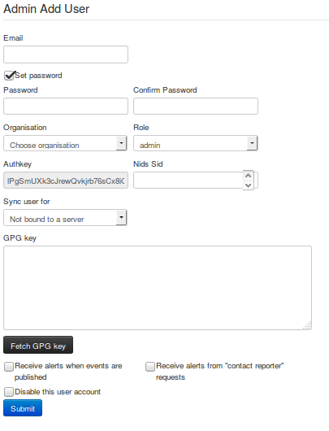

*   **Email:** The user's e-mail address, this will be used as his/her login name and as an address to send all the automatic e-mails and e-mails sent by contacting the user as the reporter of an event.
*   **Set password:** Tick the box if you want to define a temporary password for the user. If you don't, you'll should use the action button 'reset password' on 'List Users' view for generating one and send it by email to the user.
*   **Password:** *This textbox is displayed only when 'Set password' is ticked.* A Temporary password for the user that he/she should change after the first login. Make sure that it is at least 6 characters long, includes a digit or a special character and contains at least one upper-case and at least one lower-case character.
*   **Confirm Password:** *This textbox is displayed only when 'Set password' is ticked.* This should be an exact copy of the Password field.
*   **Organisation:** A drop-down list allows you to choose an organisation for the user. To learn more about organisation, [click here](#organisation).
*   **Roles:** A drop-down list allows you to choose a role-group that the user should belong to. Roles define the privileges of the user. To learn more about roles, [click here](#managing-the-roles).
*   **Authkey:** This is assigned automatically and is the unique authentication key of the user (he/she will be able to reset this and receive a new key). It is used for exports and for connecting one server to another, but it requires the user to be assigned to a role that has auth permission enabled.
*   **NIDS Sid:** ID of network intrusion detection systems.
*   **Sync user for:** Use this option for granted the user the right to synchronize the event between MISP server. This option is available for admin, Org Admin and Sync user role.
*   **Gpgkey:** The key used for encrypting e-mails sent through the system.
*   **Fetch GPG key:** Fetch GPG public key.
*   **Receive alerts when events are published:** This option will subscribe the new user to automatically generated e-mails whenever an event is published.
*   **Receive alerts from "contact reporter" requests:** This option will subscribe the new user to e-mails that are generated when another user tries to get in touch with an event's reporting organisation that matches that of the new user.
*   **Disable this user account:** Tick it if you want to disable this user account.

#### Listing all users:

To list all current users of the system, just click on List Users under the administration menu to the left. A view will be loaded with a list of all users and the following columns of information:


*   **Id:** The user's automatically assigned ID number.
*   **Org:** The organisation that the user belongs to.
*   **Email:** The e-mail address (and login name) of the user.
*   **Authkey:** Unique authentication key of the user. 
*   **Autoalert:** Shows whether the user has subscribed to auto-alerts and is always receiving the mass-emails regarding newly published events that he/she is eligible for.
*   **Contactalert:** Shows whether the user has the subscription to contact reporter e-mails directed at his/her organisation turned on or off.
*   **Gpgkey:** Shows whether the user has entered a Gpgkey yet.
*   **Nids Sid:** Shows the currently assigned NIDS ID.
*   **Termsaccepted:** This flag indicates whether the user has accepted the terms of use or not.
*   **Last login:** Date of last login.
*   **Disabled:** Show the user status. Enabled or disabled.
*   **Action Buttons:** There are 4 options available: reset the password, edit the user, delete the user or display user's information. These options are also available on the left menu.
	*    **Reset Password:** Use this action for reseting password. If you have created a new user without password, tick the 'First time registration' checkbox for sending a welcome message. Otherwise a  reset password message will be sent.
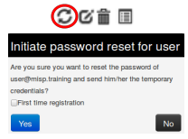
	*    **Edit the user:** Same options of create user's view. Few options are only available here:
		*   **Terms accepted:** Indicates whether the user has accepted the terms of use already or not.
		*   **Change Password:** Setting this flag will require the user to change password after the next login.
		*   **Reset Auth Key:** Use this link for generate a new AuthKey.

	*    **Delete the user:** If you want to delete a user.

	*    **Display the user:** Display all user's information.<br />
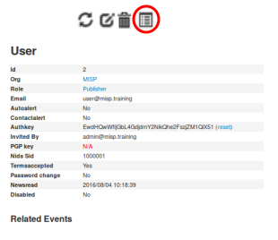

#### Contacting a user:

Site admins can use the "Contact users" feature to send all or individual user an e-mail. Users that have a PGP key set will receive their e-mails encrypted. When clicking this button on the left, you'll be presented with a form that allows you to specify the type of the e-mail, who it should reach and what the content is using the following options:


*   **Action:** This defines the type of the e-mail, which can be a custom message or a password reset. Password resets automatically include a new temporary password at the bottom of the message and will automatically change the user's password accordingly.
*   **Subject:** In the case of a custom e-mail, you can enter a subject line here.
*   **Recipient:** The recipient toggle lets you contact all your users, a single user (which creates a second drop-down list with all the e-mail addresses of the users) and potential future users (which opens up a text field for the e-mail address and a text area field for a PGP public key).
*   **Custom message checkbox:** This is available for password resets or for welcome message, you can either write your own message (which will be appended with a temporary key and the signature), or let the system generate one automatically.

Keep in mind that all e-mails sent through this system will, in addition to your own message, will be signed in the name of the instance's host organisation's support team, will include the e-mail address of the instance's support (if the contact field is set in the bootstrap file), and will include the instance's PGP signature for users that have a PGP key set (and thus are eligible for an encrypted e-mail).

- - -

### Organisations

Each users belongs to an organisation. As admin, you can manage these organisations.

#### Adding a new organisation:

To add a new organisation, click on the Add Organisation button in the administration menu to the left and fill out the following fields in the view that is loaded:

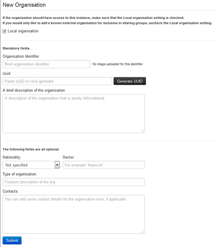

*   **Local organisation:** If the organisation should have access to this instance, tick this checkbox. If you would only like to add a known external organisation for inclusion in sharing groups, uncheck it.
*   **Organisation Identifier:** Name your organisation. If you want to add a picture, you should add a file on the webserver using the 'Server Settings menu'. Picture should have the same name. To learn more about server settings menu, [click here](#server-settings).
*   **Uuid:** Unique identifier. If you want to share organisation between MISP multi-instance, use the same Uuid.
*   **A brief description of the organisation:** A word for describing the organisation.
*   **Nationality:** A drop-down list for selecting the country of organisation.
*   **Sector:** Define the sector of organisation (financial, transport, telecom...)
*   **Type of organisation:** Define the type of the organisation.
*   **Contacts:** You can add some contact details for the organisation.

#### Listing all organisation:

To list all current organisation of the system, just click on List Organisations under the administration menu to the left. There are 3 tabs in this view for filtering the local organisations, remote organisations and both. Default view display local organisations. For all views the following columns of information are available:


*   **Id:** The organisation's automatically assigned ID number.
*   **Logo:** Picture of the organisation.
*   **Name:** Name of the organisation.
*   **Uuid:** Unique identifier of orgnisation. Share this Uuid for using it between MISP's multi-instance.
*   **Description:** Description of the organisation.
*   **Nationality:** Country of the organisation.
*   **Sector:** Sector defined for the organisation.
*   **Type:** Type of organisation.
*   **Contacts:** Contacts of orgnisation.
*   **Added by:** Login of the user which have added the organisation
*   **Local:** Flag defined if the organisation is local or remote.
*   **Actions:**  There are 3 options available: edit, delete or display organisation's information. These options are also available on the left menu when you are on the display view.
	*    **Edit Organisation:** Same options of create organisation's view.
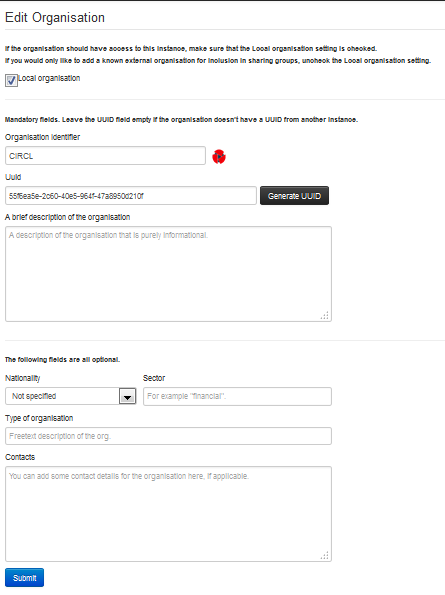	
	*    **Delete Organisation:** Use this option for deleting organisation.<br />
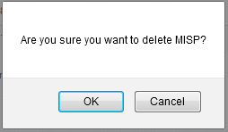	 
	*    **View Organisation:** Use this option for displaying information about organisation selected. In this view, you can display the user belongs to this organisation and events published by organisation.
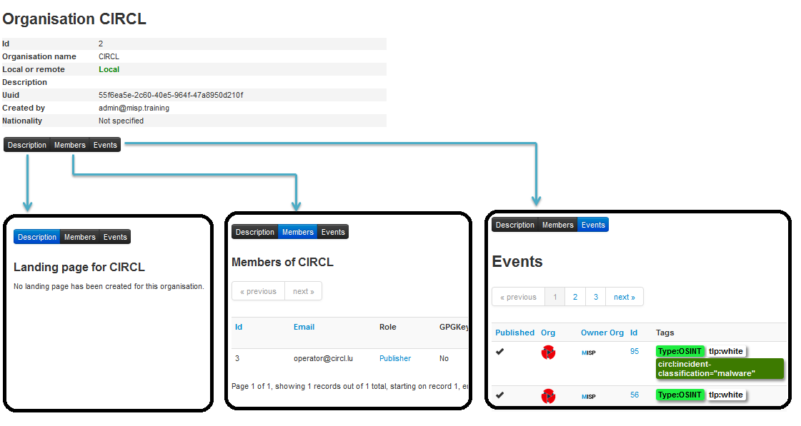	

#### Merge organisations:
Merge Organisation menu is available only in the view organisation, under the left menu. Merge one organisation to another will transfer all users and data from one to another. On the left the organisation to merge, on the right the target one.

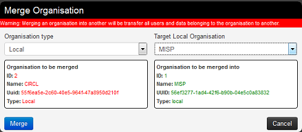

- - -

### Roles

Privileges are assigned to users by assigning them to rule groups, which use one of four options determining what they can do with events and four additional privilege elevating settings. The four options for event manipulation are: Read Only, Manage My Own Events, Manage Organisation Events, Manage & Publish Organisation Events. A short description is provided below:

*   **Read Only:** This allows the user to browse events that his organisation has access to, but doesn't allow any changes to be made to the database.
*   **Manage My Own Events:** The second option, gives its users rights to create, modify or delete their own events, but they cannot publish them.
*   **Manage Organization Events:** Allows users to create events or modify and delete events created by a member of their organisation.
*   **Manage & Publish Organisation Events:** This last setting, gives users the right to do all of the above and also to publish the events of their organisation.

The extra permissions are defined below:

*   **Perm Admin:** Gives the user limited administrator privileges, this setting is used for the organisation admins.
*   **Perm Audit:** Grants access to the logs. With the exception of site admins, only logs generated by the user's own org are visible.
*   **Perm Tagger:** Allow user to assign tags to events.
*   **Perm Sharing Group:** Grant access to edit or create sharing groups.
*   **Perm Site Admin:** Gives the user full administrator privileges, this setting is used for the site admins.
*   **Perm Auth:** This setting enables the authentication key of the role's users to be used for rest requests.
*   **Perm Tag Editor:** Grand access to edit or create new local tags or from taxonomies. 
*   **Perm Delegate:** Grant access to delegate the publication of an event to a third-party organization.
*   **Perm Sync:** This setting allows the users of the role to be used as a synchronisation user. The authentication key of this user can be handed out to the administrator of a remote MISP instance to allow the synchronisation features to work.
*   **Perm Regexp Access:** Allows the users with this permission enabled to edit the regular expression table. Be careful when giving out this permission, incorrect regular expressions can be very harmful (infinite loops, loss of data, etc.).
*   **Perm Template:** Grant access to create or modify templates.

#### Adding a new role:

When creating a new role, you will have to enter a name for the role to be created and set up the permissions (as described above) using the drop-down menu and the check-boxes.


#### Listing roles:

By clicking on the List Roles button, you can view a list of all the currently registered roles and a list of the permission flags turned on for each. In addition, you can find buttons that allow you to edit and delete the roles. Keep in mind that you will need to first remove every member from a role before you can delete it.

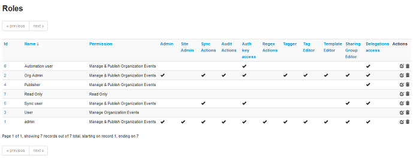

*   **Id:** The role's automatically assigned ID number.
*   **Name:** The name of role.
*   **Permission:** One of the 4 permissions: Read Only, Manage My Own Events, Manage Organization Events, Manage & Publish Organisation Events. 
*   **Extra Permissions flag:** Flag for each extra permissions: Admin, Site Admin, Sync Actions, Audit Actions, Auth key access, Regex Actions, Tagger, Tag Editor, Template Editor, Sharing Group Editor, Deletagions Access.
*   **Action Buttons:** There are 2 options available: Edit Role or Delete it.
	*    **Edit Role:** Same options of create role's view.<br />
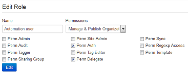
	*    **Delete Role:** Use this option for deleting a role.<br />


- - -

### Tools

MISP has a couple of administrative tools that help administrators keep their instance up to date and healthy. The list of these small tools can change rapidly with each new version, but they should be self-explanatory. Make sure to check this section after upgrading to a new version, just in case there is a new upgrade script in there - though if this is the case it will be mentioned in the upgrade instructions.

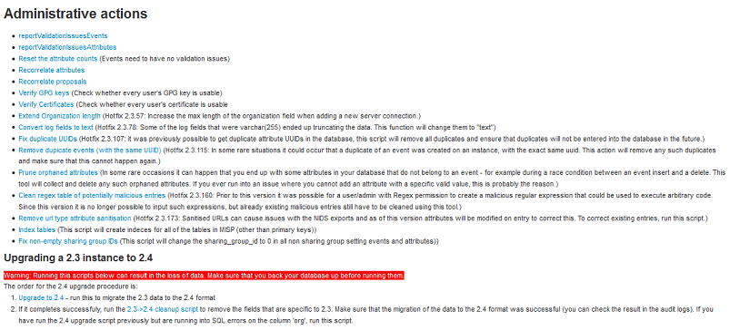

- - -

### Server Settings

Since version 2.3, MISP has a settings and diagnostics tool that allows site-admins to manage and diagnose their MISP installation. You can access this by navigating to Administration - Server settings.


### Server settings and diagnostics


The settings and diagnostics tool is split up into several aspects, all accessible via the tabs ontop of the tool. For any unset or incorrectly set setting, or failed diagnostic a number next to the tab name will indicate the number and severity of the issues. If the number is written with a red font, it means that the issue is critical. First, let's look at the various tabs:
*   **Overview**: General overview of the current state of your MISP installation
*   **MISP settings**: Basic MISP settings. This includes the way MISP handles the default settings for distribution settings, whether background jobs are enabled, etc
*   **GnuPG settings**: GPG related settings.
*   **Proxy settings**: HTTP proxy related settings.
*   **Security settings**: Settings controlling the brute-force protection and the application's salt key.
*   **Misc settings**: You change the debug options here, but make sure that debug is always disabled on a production system.
*   **Diagnostics**: The diagnostics tool checks if all directories that MISP uses to store data are writeable by the apache user. Also, the tool checks whether the STIX libraries and GPG are working as intended.
*   **Workers**: Shows the background workers (if enabled) and shows a warning if they are not running. Admins can also restart the workers here.
*   **Download report**: Download a report in JSON format, compiled of all of the settings visible in the tool.


Each of the setting pages is a table with each row representing a setting. Coloured rows indicate that the setting is incorrect / not set and the colour determines the severity (red = critical, yellow = recommended, green = optional). The columns are as follows:
*   **Priority**: The severity of the setting.
*   **Setting**: The setting name.
*   **Value**: The current value of the setting.
*   **Description**: A description of what the setting does.
*   **Error Message**: If the setting is incorrect / not set, then this field will let the user know what is wrong.


The workers tab shows a list of the workers that MISP can use. You can restart the workers using the restart all workers, If the button doesn't work, make sure that the workers were started using the apache user. This can however only be done using the command line, refer to the INSTALL.txt documentation on how to let the workers automatically start on each boot.

*   **Worker Type**: The worker type is determined by the queue it monitors. MISP currently has 5 queues (cache, default, prio, email and a special _schdlr_ queue).
*   **Worker Id**: The ID is made up of the machine name, the PID of the worker and the queue it monitors.
*   **Status**: Displays OK if the worker is running. If the _schdlr_ worker is the only one not running make sure that you copy the config file into the cakeresque directory as described in the INSTALL.txt documentation.


### Import Blacklist

It is possible to ban certain values from ever being entered into the system via an event info field or an attribute value. This is done by blacklisting the value in this section.

#### Adding and modifying entries

Administrators can add, edit or delete blacklisted items by using the appropriate functions in the list's action menu and the menu on the left.

### Import Regexp

The system allows administrators to set up rules for regular expressions that will automatically alter newly entered or imported events (from GFI Sandbox).

#### The purpose of Import Regexp entries

They can be used for several things, such as unifying the capitalisation of file paths for more accurate event correlation or to automatically censor the usernames and use system path variable names (changing C:\Users\UserName\Appdata\Roaming\file.exe to %APPDATA%\file.exe).
The second use is blocking, if a regular expression is entered with a blank replacement, any event info or attribute value containing the expression will not be added. Please make sure the entered regexp expression follows the preg_replace pattern rules as described [here](http://php.net/manual/en/function.preg-replace.php)

#### Adding and modifying entries

Administrators can add, edit or delete regular expression rules, which are made up of a regex pattern that the system searches for and a replacement for the detected pattern.


### Managing the Signature whitelist

The signature whitelist view, accessible through the administration menu on the left, allows administrators to create and maintain a list of addresses that are whitelisted from ever being added to the NIDS signatures. Addresses listed here will be commented out when exporting the NIDS list.

#### Whitelisting an address:

While in the whitelist view, click on New Whitelist on the left to bring up the add whitelist view to add a new address.

#### Managing the list:

When viewing the list of whitelisted addresses, the following pieces of information are shown: The ID of the whitelist entry (assigned automatically when a new address is added), the address itself that is being whitelisted and a set of controls allowing you to delete the entry or edit the address.


### Using the logs of MISP

Users with audit permissions are able to browse or search the logs that MISP automatically appends each time certain actions are taken (actions that modify data or if a user logs in and out).
Generally, the following actions are logged:

*   **User:** Creation, deletion, modification, Login / Logout
*   **Event:**Creation, deletion, modification, publishing
*   **Attribute:** Creation, deletion, modification
*   **ShadowAttribute:** Creation, deletion, Accept, Discard
*   **Roles:** Creation, deletion, modification
*   **Blacklist:** Creation, deletion, modification
*   **Whitelist:** Creation, deletion, modification
*   **Regexp:** Creation, deletion, modification


#### Browsing the logs:

Listing all the log entries will show the following columns generated by the users of your organisation (or all organisations in the case of site admins):


*   **Id:** The automatically assigned ID number of the entry.
*   **Email:** The e-mail address of the user whose actions triggered the entry.
*   **Org:** The organisation of the above mentioned user.
*   **Created:** The date and time when the entry originated.
*   **Action:** The action's type. This can include: login/logout for users, add, edit, delete for events, attributes, users and servers.
*   **Title:** The title of an event always includes the target type (Event, User, Attribute, Server), the target's ID and the target's name (for example: e-mail address for users, event description for events).
*   **Change:** This field is only filled out for entries with the action being add or edit. The changes are detailed in the following format:
   __variable (initial_value)_ => _(new_value)_,...
   When the entry is about the creation of a new item (such as adding a new event) then the change will look like this for example:
   _org()_ => _(ADMIN)_, _date()_ => _(20012-10-19)_,...


#### Searching the Logs:

Another way to browse the logs is to search it by filtering the results according to the following fields (the search is a sub-string search, the sub-string has to be an exact match for the entry in the field that is being searched for):

*   **Email:** By searching by Email, it is possible to view the log entries of a single user.
*   **Org:** Searching for an organisation allows you to see all actions taken by any member of the organisation.
*   **Action:** With the help of this drop down menu, you can search for various types of actions taken (such as logins, deletions, etc).
*   **Title:** There are several ways in which to use this field, since the title fields contain several bits of information and the search searches for any substrings contained within the field, it is possible to just search for the ID number of a logged event, the username / server's name / event's name / attribute's name of the event target.
*   **Change:** With the help of this field, you can search for various specific changes or changes to certain variables (such as published will find all the log entries where an event has gotten published, ip-src will find all attributes where a source IP address has been entered / edited, etc).


### Background Processing

If enabled, MISP can delegate a lot of the time intensive tasks to the background workers. These will then be executed in order, allowing the users of the instance to keep using the system without a hiccup and without having to wait for the process to finish. It also allows for certain tasks to be scheduled and automated.

#### Command Line Tools for the Background Workers

The background workers are powered by [CakeResque](https://github.com/kamisama/Cake-Resque), so all of the CakeResque commands work.
To start all of the workers needed by MISP go to your `/var/www/MISP/app/Console/worker` (assuming a standard installation path) and execute start.sh.
To interact with the workers, here is a list of useful commands. Go to your `/var/www/MISP/app/Console` (assuming a standard installation path) and execute one of the following commands as a parameter to `./cake CakeResque.CakeResque` (for example: `./cake CakeResque.CakeResque tail`):

*   **tail**: tail the various log files that CakeResque creates, just choose the one from the list that you are interested in.
*   **cleanup**: terminate the job that a worker is working on immediately. You will be presented with a choice of workers to choose from when executing this command.
*   **clear**: Clear the queue of a worker immediately.
*   **stats**: shows some statistics about your workers including the count of successful and failed jobs.

The other commands should not be needed, instead of starting / stopping or restarting workers use the supplied start.sh (it stops all workers and starts them all up again). For further instructions on how to use the console commands for the workers, visit the [CakeResque list of commands](http://cakeresque.kamisama.me/commands#cleanup).

#### Monitoring the Background Processes

The "Jobs" menu item within the Administration menu allows site admins to get an overview of all of the currently and in the past scheduled jobs. Admins can see the status of each job, and what the queued job is trying to do. If a job fails, it will try to set an error message here too. The following columns are shown in the jobs table:

*   **Id**: The job's ID (this is the ID of the job's metadata stored in the default datastore, not to be confused with the process ID stored in the redis database and used by the workers)
*   **Process**: The process's ID.
*   **Worker**: The name of the worker queue. There are 3+1 workers running if background jobs are enabled: default, cache, email, and a special Scheduler (this should never show up in the jobs table).
*   **Job Type**: The name of the queued job.
*   **Input**: Shows a basic input handled by the job - such as "Event:50" for a publish email alert job for event 50.
*   **Message**: This will show what the job is currently doing or alternatively an error message describing why a job failed.
*   **Org**: The string identifier of the organisation that has scheduled the job.
*   **Status**: The status reported by the worker.
*   **Retries**: Currently unused, it is planned to introduced automatic delayed retries for the background processing to add resilience.
*   **Progress**: A progress bar showing how the job is coming along.


#### Scheduling Jobs and Recurring Jobs

Apart from off-loading long-lasting jobs to the background workers, there is a second major benefit of enabling the background workers: Site-administrators can schedule recurring tasks for the jobs that generally take the longest to execute. At the moment this includes pushing / pulling other instances and generating a full export cache for every organisation and export type. MISP comes with these 3 tasks pre-defined, but further tasks are planned. The following fields make up the scheduled tasks table:

*   **Id**: The ID of the task.
*   **Type**: The type of the task.
*   **Frequency (h)**: This number sets how often the job should be executed in hours. Setting this to 168 and picking the next execution on Sunday at 01:00 would execute the task every Sunday at 1 AM. Setting this value to 0 will make the task only run once on the scheduled date / time without rescheduling it afterwards.
*   **Scheduled Time**: The time (in 24h format) when the task should be executed the next time it runs (and all consecutive times if a multiple of 24 is chosen for frequency).
*   **Next Run**: The date on which the task should be executed.
*   **Description**: A brief description of the task.
*   **Message**: This field shows when the job was queued by the scheduler for execution.


### Various administration tips & tricks

#### Default sharing level

Choose your default sharing level to match your usage scenario for MISP. The setting is named *default_event_distribution* and the values can be:

*   Your organisation only (default)
*   This community only
*   Connected communities
*   All communities

You can also set a default distribution level for attributes contained in an event with *default_attribute_distribution*, and it has the same values as the default sharing level for events plus an additional one that allows attributes to inherit the sharing level of the event.

#### Adding organisation logos

You can add logo for organisations in MISP by uploading them via the tab **Manage files** under the **Administration** menu & **Server Settings** sub-menu.
The filename must be exactly the same as the organisation name that you will use in MISP.
It is recommended to use PNG files of 48x48 pixels.

#### The \_schdlr\_ worker is not starting

If you already made sure that you copied the config file under the cakeresque directory, it might be due to the FQDN of the server hosting the instance has changed. A way to fix this is to flush temporary data stored in redis. This can be done by logging in redis, for example when logging in with redis-cli, and issuing a flushall command.

#### How to redirect HTTP to HTTPS

Here is a sample configuration for Apache webserver.
```
<VirtualHost *:80>
        ServerAdmin misp@misp.misp
        ServerName misp.misp.misp
        ServerAlias misp-int.misp.misp

        Redirect permanent / https://misp.misp.misp

        LogLevel warn
        ErrorLog /var/log/apache2/misp.local_error.log
        CustomLog /var/log/apache2/misp.local_access.log combined
        ServerSignature Off
</VirtualHost>

<VirtualHost *:443>
        ServerAdmin misp@misp.misp
        ServerName misp.misp.misp
        ServerAlias misp-int.misp.misp

        DocumentRoot /var/www/MISP/app/webroot
        <Directory /var/www/MISP/app/webroot>
                Options -Indexes
                AllowOverride all
                Order allow,deny
                allow from all
        </Directory>

        SSLEngine On
        SSLCertificateFile /etc/ssl/misp.misp.misp/misp.crt
        SSLCertificateKeyFile /etc/ssl/misp.misp.misp/misp.key
        SSLCertificateChainFile /etc/ssl/misp.misp.misp/mispCA.crt

        LogLevel warn
        ErrorLog /var/log/apache2/misp.local_error.log
        CustomLog /var/log/apache2/misp.local_access.log combined
        ServerSignature Off
</VirtualHost>
 ```
   Taken from [Koen Van Impe's blog](http://www.vanimpe.eu/2015/05/31/getting-started-misp-malware-information-sharing-platform-threat-sharing-part-3/)

#### Increase max size of Samples / other files

Trying to upload a large samples (>50M) might cause the following error:
```[!] 500 Server Error: Internal Server Error```

Or will give you an error page in browser.

The error logs on the system will show you the following:

```
PHP Warning:  POST Content-Length of 57526024 bytes exceeds the limit of 8388608 bytes in Unknown on line 0, referer: https://XYZ/attributes/add_attachment/1948
```

And / Or

```
PHP Fatal error:  Allowed memory size of 134217728 bytes exhausted (tried to allocate 76705009 bytes) in /var/www/MISP/app/Lib/cakephp/lib/Cake/Network/CakeRequest.php on line 996
```

To fix that you have to adjust the php settings:
```
vi /etc/php5/apache2/php.ini
```

Increase to the following values (or more if you like to)
```
; Maximum size of POST data that PHP will accept.
; Its value may be 0 to disable the limit. It is ignored if POST data reading
; is disabled through enable_post_data_reading.
; http://php.net/post-max-size
post_max_size = 256M
[...]
; Maximum amount of memory a script may consume (128MB)
; http://php.net/memory-limit
memory_limit = 1024M
```

And then restart apache2

```
service apache2 restart
```

#### Support & feature requests

The preferred method for support & feature requests is to use the [GitHub ticketing system](https://github.com/MISP/MISP/issues).

If you want to discuss about something related to MISP, want help from the community, etc... You have
the [MISP Users mailing list](https://groups.google.com/forum/#!forum/misp-users) and the [MISP developers mailing list](https://groups.google.com/forum/#!forum/misp-devel).

A number of companies are also offering custom development, consulting, and support around MISP, please check [the support page of the MISP Project website](http://www.misp-project.org/#support).

#### More information in the notification emails about new events

The setting MISP.extended_alert_subject allows you to have an extended subject. One word of warning though. If you’re using encryption : the subject will not be encrypted. Be aware that you might leak some sensitive information this way. Below is an example how the two subject types look like. First with the option disabled, then with the option enabled.
```
Event 7 - Low - TLP Amber
Event 8 - OSINT - Dissecting  XXX... - Low - TLP Amber
```

   Taken from [Koen Van Impe's blog](http://www.vanimpe.eu/2015/05/31/getting-started-misp-malware-information-sharing-platform-threat-sharing-part-3/)

#### Get top API users

Enable the _log_auth_ setting in the server settings. Optionally enable _log_client_ip_ if you want to get stats per client ip.
Log into your mysql server and run the following query:
```
select ip,email,count(id) as c from logs WHERE ip IS NOT NULL group by ip,email order by c desc limit 10;
```

This will give you a top 10 table per ip and username:
```
+----------------+----------------------------------+------+
| ip             | email                            | c    |
+----------------+----------------------------------+------+
| 1.2.3.4        | bob@nsa.gov                      | 4124 |
| 5.6.7.8        | vladimir@kremlin.ru              | 1932 |
| 9.10.11.12     | fred@somewhere.eu                | 1317 |
| 13.14.15.16    | SYSTEM                           |   16 |
+----------------+----------------------------------+------+
```

#### MISP Logs

By default, MISP has several layers of logs that can be used to trouble-shoot and to monitor the system. Let's walk through each of the available logs:

*   **Apache access logs**: Rotating logs generated by apache, logging each request, by default (on Ubuntu) they are found in /var/log/apache2/misp.local\_access.log. The location can be changed via the apache conf file
*   **Apache error logs**: Rotating logs generated by apache, logging error messages, by default (on Ubuntu) they are found in /var/log/apache2/misp.local\_error.log. This error log file will generally not be used by MISP, however, if there is a PHP level error that prevents MISP from functionining you might have relevant entries here.
*   **MISP error log**: Generated by MISP, logging any exceptions that occur during usage. These can be found in /var/www/MISP/app/tmp/logs/error.log (assuming default installation path). If you are seeins errors in here and are stuck with an issue let us know via github!
*   **MISP debug log**: Generated by MISP, any debug messages and Notice level messages will be sent to this file. Generally less interesting, but can be helpful during debuging sessions. It should not be necesary to monitor this under normal usage. The file can be found in /var/www/MISP/app/tmp/logs/debug.log (assuming default installation path).
*   **MISP worker error log**: Generated by MISP background workers, logging any exceptions generated during a background job. It is the equivalent of the MISP error log for background jobs, so if scheduled tasks, synchronisation or e-mailing with the workers enabled are causing issues, this is the place to check. It can normally be found at /var/www/MISP/app/tmp/logs/resque-worker-error.log
*   **MISP worker logs**: Rotating logs generated by MISP background workers, logging any jobs executed by workers. This is part of the normal operation of background workers and doesn't have to be monitored, though it can help when debugging issues. Normally found at /var/www/MISP/app/tmp/logs/resque-[current date].log
*   **MISP scheduler error log**: Generated by MISP scheduler worker, logging any exceptions generated during the scheduling of a background job. It is the equivalent of the MISP error log for scheduled jobs. It can normally be found at /var/www/MISP/app/tmp/logs/resque-scheduler-error.log
*   **MISP scheduler logs**: Rotating logs generated by MISP scheduler worker, logging any schedulings of jobs to be executed by workers. This is part of the normal operation of the scheduler worker and doesn't have to be monitored, though it can help when debugging issues. Normally found at /var/www/MISP/app/tmp/logs/resque-scheduler-[current date].log

#### Logging of failed authentication attempts

By default, MISP logs all failed login and authentication attempts in the built in Audit logs. To view any such failed attempts, simply log in as a site admin and navigate to Audit - List logs.

There are two types of entries that will be interesting if you are looking for failed authentication attempts, entries of action "auth\_fail" (for failed attempts to authenticate via the API key or the external authentication system) and login\_fail (for failed login attempts via the login page).

You can also search for any such entries using the Search Logs feature, simply choose the desired action from the two listed above and hit search.

What is logged:

```
+----------------+------------+---------------------------+----------+
| Auth method    | Action     | Failed credentials logged | IP       |
+----------------+------------+---------------------------+----------+
| Webform        | login_fail | None                      | Optional |
| API            | auth_fail  | API key                   | Optional |
| Webform        | auth_fail  | External auth key         | Optional |
+----------------+------------+---------------------------+----------+
```

In order to enable IP logging for any logged request in MISP, navigate to Administration - Server settings - MISP settings and enable the MISP.log\_client\_ip setting.

It is also possible to enable full logging of API and external authentication requests using the MISP.log\_auth setting in the same location, but keep in mind that this is highly verbose and will log every request made. In addition to the information above, all accessed resource URLs are also logged.

#### Clearing expired sessions

By default the garbage collection of sessionsis disabled in PHP. It is possible to enable it, but it's not recommended and as such MISP provides a manual way of clearing the sessions.

Navigate to the diagnostics screen of MISP (Administration - Server settings - Diagnostics) and near the bottom of the page there will be a counter showing the count of currently stored expired sessions. Simply purge them by clicking the applicable button when the number grows too large.

#### Troubleshooting MISP not connecting to redis but redis-cli working

If you have an IPv6 enabled OS, but an older redis version that does not support IPv6 (<v2.8), MISP might fail to connect to the redis server while redis-cli is working.
The reason is that redis-cli is connecting to 127.0.0.1 directly, while the calls inside the CakeResque library used by MISP are done using "*localhost*" which resolves both to the IPv4 and IPv6 loopback addresses. For some reasons, the use of the IPv6 address is attempted first which fails.


You can confirm this by trying to connect to redis using **telnet localhost 6379**. If it fails, the error message should mention the IPv6 loopback address (::1).


Two ways to fix it:

1) Upgrade your redis to a server that supports IPv6 (v2.8+). This is the preferred recommendation.

2) Comment the localhost mapping to IPv6 address in /etc/hosts


#### Errors about fields or tables

If you have errors with fields or tables that you can see in the error.log or in the page (if you enabled _debug_ or _site_admin_debug_ settings), an easy first them to make most of them go away is to use the **clean cache** feature on the _server settings_ menu, _diagnostics_ tab.
An example of error message:
```
Error: [PDOException] SQLSTATE[42S22]: Column not found: 1054 Unknown column 'Task.job_id' in 'field list'
```
