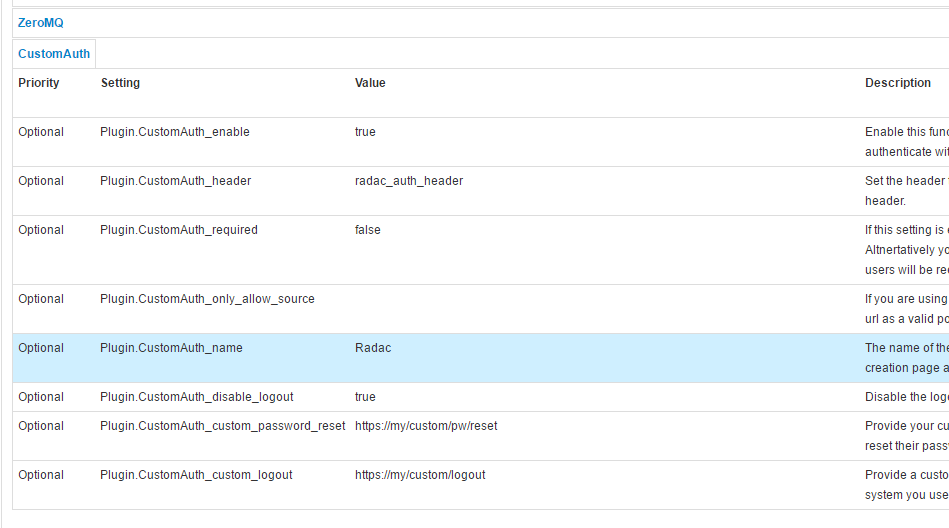

# Appendix A: External Authentication

#### The external authentication mechanism described

The external authentication allows a user or an external tool to authenticate with MISP using an arbitrary value passed along in a custom header. This authentication method overrides the regular authentication mechanisms and is customisable by a site-admin. 

It is possible to create a mixed mode MISP setup where certain users can go through the normal authentication mechanism and other users are required to use the external authentication method.

#### Setting up the external authentication mechanism

To change the authentication settings, navigate to Administration - Server settings - Plugin settings

The settings associated with the external authentication can be found by pressing the CustomAuth button as depicted below:

To change a setting simply double click on the value to edit the field. Use the guidance provided by the setting tool to configure the external authentication. The accessible settings are as follows:

*   **enable**: Enable or disable external authentication (off by default)

*   **header**: The header which MISP will use to identify users

*   **required**: Enabling this setting will force all users to use the external authentication. Leave this disabled allows administrators to assign external authentication or regular authentication users.

*   **only_allow_source**: Setting a url / IP address here will only allow requests that originated from the given address

*   **name**: The name to be used for the authentication mechanism. This is reflected in the user creation / edit views, the logs and the error messages on failed logins.

*   **disable_logout**: Disable the default logout button. Using an external authentication mechanism that authenticates via the header with each requests makes the logout button obsolete. 

*   **custom_password_reset**: If your authentication system has a url that a user can access to reset his/her password, please specify the full url for it here. This will then be reused in the UI.

*   **custom_password_logout**: If your authentication system has a url that a user can access to logout, please specify the full url for it here. This will then be reused in the UI.

#### User management

Using a new setting, user self management can be disabled for all users that are not administrators via the MISP.disableUserSelfManagement setting, found in the MISP settings tab. Enabling this setting removes the ability of users to change their user settings and reset their authentication keys. All other functionality remains unchanged.

To create an external authenticated user, simply tick the External authentication user checkbox, after which an external auth key field will appear. This will be used to identify the users via the passed along header. 

#### Logging

For a description of the logging facilities provided by this plugin, please refer to the "Logging of failed authentication attempts" section of the Administration section.

# Appendix B: ACL descriptors

#### Querying the ACL system

MISP allows site admins to query the ACL system for various types of data. This can be interesting when tuning for example WAF access to MISP. All applicable queries can be requested via /servers/queryACL

#### Getting a list of URLs accessible to a role

~~~~
https://<misp url>/servers/queryACL/printRoleAccess/<role id>
~~~~

The above URL will return a JSON with all accessible URLs for the given role ID. If no Role ID is provided, a JSON containing all roles and their access lists will be returned. 

Example:

~~~~json
{
  "2": {
    "name": "User",
    "urls": [
      "/attributes/add/*",
      "/attributes/add_attachment/*",
      "/attributes/add_threatconnect/*",
      "/attributes/attributeReplace/*",
      "/attributes/delete/*",
      "/attributes/deleteSelected/*",
      "/attributes/download/*",
      "/attributes/downloadAttachment/*",
      "/attributes/downloadSample/*",
      "/attributes/edit/*",
      "/attributes/editField/*",
      "/attributes/editSelected/*",
      "/attributes/fetchEditForm/*",
      "/attributes/fetchViewValue/*",
      "/attributes/hoverEnrichment/*",
      "/attributes/index/*",
      "/attributes/restSearch/*",
      "/attributes/returnAttributes/*",
      "/attributes/rpz/*",
      "/attributes/search/*",
      "/attributes/searchAlternate/*",
      "/attributes/text/*",
      "/attributes/updateAttributeValues/*",
      "/attributes/view/*",
      "/eventDelegations/acceptDelegation/*",
      "/eventDelegations/delegateEvent/*",
      "/eventDelegations/deleteDelegation/*",
      "/eventDelegations/view/*",
      "/events/add/*",
      "/events/addIOC/*",
      "/events/addTag/*",
      "/events/add_misp_export/*",
      "/events/contact/*",
      "/events/csv/*",
      "/events/delegation_index/*",
      "/events/delete/*",
      "/events/downloadExport/*",
      "/events/downloadOpenIOCEvent/*",
      "/events/downloadSearchResult/*",
      "/events/edit/*",
      "/events/export/*",
      "/events/exportChoice/*",
      "/events/filterEventIndex/*",
      "/events/freeTextImport/*",
      "/events/hids/*",
      "/events/index/*",
      "/events/nids/*",
      "/events/proposalEventIndex/*",
      "/events/queryEnrichment/*",
      "/events/removePivot/*",
      "/events/removeTag/*",
      "/events/restSearch/*",
      "/events/saveFreeText/*",
      "/events/stix/*",
      "/events/updateGraph/*",
      "/events/view/*",
      "/events/viewEventAttributes/*",
      "/events/viewGraph/*",
      "/events/xml/*",
      "/jobs/cache/*",
      "/jobs/getGenerateCorrelationProgress/*",
      "/jobs/getProgress/*",
      "/logs/event_index/*",
      "/logs/maxDateActivity/*",
      "/logs/returnDates/*",
      "/organisations/fetchOrgsForSG/*",
      "/organisations/fetchSGOrgRow/*",
      "/organisations/index/*",
      "/organisations/landingpage/*",
      "/organisations/view/*",
      "/pages/display/*",
      "/posts/add/*",
      "/posts/delete/*",
      "/posts/edit/*",
      "/regexp/index/*",
      "/roles/index/*",
      "/roles/view/*",
      "/servers/fetchServersForSG/*",
      "/shadowAttributes/accept/*",
      "/shadowAttributes/acceptSelected/*",
      "/shadowAttributes/add/*",
      "/shadowAttributes/add_attachment/*",
      "/shadowAttributes/delete/*",
      "/shadowAttributes/discard/*",
      "/shadowAttributes/discardSelected/*",
      "/shadowAttributes/download/*",
      "/shadowAttributes/edit/*",
      "/shadowAttributes/editField/*",
      "/shadowAttributes/fetchEditForm/*",
      "/shadowAttributes/index/*",
      "/shadowAttributes/view/*",
      "/sharingGroups/index/*",
      "/sharingGroups/view/*",
      "/sightings/add/*",
      "/sightings/delete/*",
      "/tags/add/*",
      "/tags/delete/*",
      "/tags/edit/*",
      "/tags/index/*",
      "/tags/quickAdd/*",
      "/tags/selectTag/*",
      "/tags/selectTaxonomy/*",
      "/tags/showEventTag/*",
      "/tags/view/*",
      "/tags/viewTag/*",
      "/taxonomies/index/*",
      "/taxonomies/taxonomyMassConfirmation/*",
      "/taxonomies/view/*",
      "/templateElements/index/*",
      "/templates/deleteTemporaryFile/*",
      "/templates/index/*",
      "/templates/populateEventFromTemplate/*",
      "/templates/submitEventPopulation/*",
      "/templates/templateChoices/*",
      "/templates/uploadFile/*",
      "/templates/view/*",
      "/threads/index/*",
      "/threads/view/*",
      "/threads/viewEvent/*",
      "/users/dashBoard/*",
      "/users/downloadTerms/*",
      "/users/edit/*",
      "/users/histogram/*",
      "/users/index/*",
      "/users/login/*",
      "/users/logout/*",
      "/users/memberslist/*",
      "/users/resetauthkey/*",
      "/users/routeafterlogin/*",
      "/users/statistics/*",
      "/users/terms/*",
      "/users/updateLoginTime/*",
      "/users/view/*",
      "/whitelists/index/*"
    ]
  }
}
~~~~

#### Getting a list of all accessible controllers and actions in MISP

~~~~
https://<misp url>/servers/queryACL/printAllFunctionNames
~~~~

This URL will return a JSON with all controller and all mapped functions within them. 

#### Viewing a list of yet unmapped functions

~~~~
https://<misp url>/servers/queryACL/findMissingFunctionNames
~~~~

Functions that have not been tied into the new ACL yet show up here. These functions will (until added to the ACL) only be accessible to site admins.

