## Create an event based on a report

> [warning] A specific permission is required to create an event.

For this example, we will use a report found on [Bleeping Computer](http://www.bleepingcomputer.com/news/security/researcher-finds-the-karma-ransomware-being-distributed-via-pay-per-install-network/), so considered as OSINT.

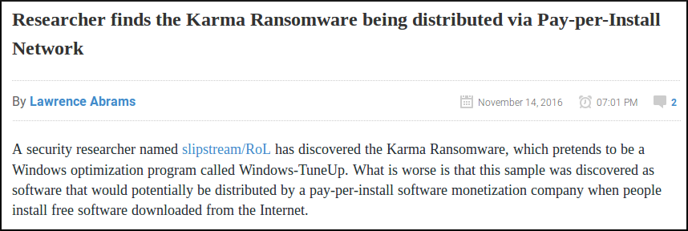

### The metadata

First of all, we need to create a new event. To do so, we click the "Add Event" option when on the Events list view.

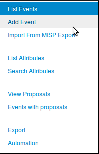

Then we get the add event form.

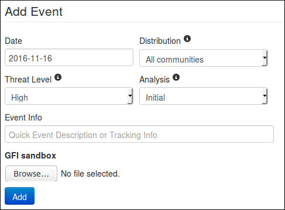

Let's fill it with the data we already have:
* Date: Here we will put the date of the report, so 2016-11-14
* Distribution: Depending on the event, we might want it to be more or less spread accross the MISP instances. For this one, since it is a public report, there is no reason to limit the diffusion so "All communities".
* Threat Level: Self explainatory. Since the ransomware in the report is not using a huge exploit, we can use low, or undefined as we don't really know. we'll go for the latter since it can be edited. 
* Analysis: Give the current stage of the analysis. Since the report is published, we can assume that the analysis is completed.
* Event Info: The event's info is in fact the name or title of the event, so it seems legit to put the title of the report here as well. Since it is public information, we also prefix it with "OSINT".
* GFI sandbox: Since we don't have any sample or anything here, we leave this alone.

Then just press the blue "Add" button and here we have a brand new event. Empty.

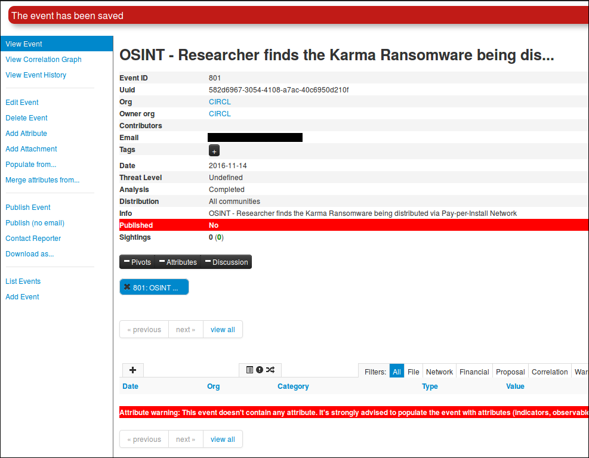  
(Displayed information can change depending on your role on the MISP instance)

Now it is time to populate this event. But before even adding IoC, we are going to add global information about the report itself: the link of the report and a short explanation or introduction. To do so, we need to click on the "Add Attribute" option in the side menu. This will show us this view:

* First we are going to add the link of the report. Since it has been written by an other researcher, it will be considered as an "External analysis", we choose this category. 
* Concerning the type, regarding the kind of data we are adding it is obvious that we will choose the "link" type.
* The distribution field can be a little tricky. We can either choose one of the option that was already available at event level or "Inherit event". If we choose the latter, the attribute will be shared the same way as the event it is included in (here to "All communities"). On the other hand, if we choose manually a distribution for the attribute, the most restritive between event distribution and attribute distribution will be applied. That is to say: if both event and attribute distributions are the same, there will be no change (similar to "Inherit event"). However, if for instance the event distribution is "all communities" while the attribute is limited to "This community only", the event will indeed be distributed to all communities but without this particular attribute which will be limited to this community only. The same works the other way around, if the attribute can be distributed to "all communities" while the related event is limited to this community, the attribute being dependant of the event, it will be shared to this community only, basing its distribution on the event (most restrictive) one.
* The value is simply the data we want to add, here it is the link of the report.
* The contextual comment is a field that will not be used for correlation and is mainly there to add some complementary information on the attribute. Can be a port for an IP, or an indication of any type. Here there is no perticular information to add, except maybe tell that it is the source of the report, so let us put this information.
* "for Intrusion Detection System" is used to set the IDS flag or not. If set, the attribute will be used as an IDS signature when exporting the NIDS data. In this case, we have no reason to check it.
* The Batch Import is a useful option when we need to add several IoC of the same category/type which allow you to add them at once by separated by a line break between each line in the value field. However it is of no use here.

All fields are properly filled ? Then let's press the "submit" button, and Ta-dah !

Now we can do a similar procedure to add an introduction to the report (that is to say the first paragraph of the report). We will simply change the type for text. But this time, we will access the add attribute form by clicking on the small + symbol next to the attribute table.

The same form as before will appear in a popup.

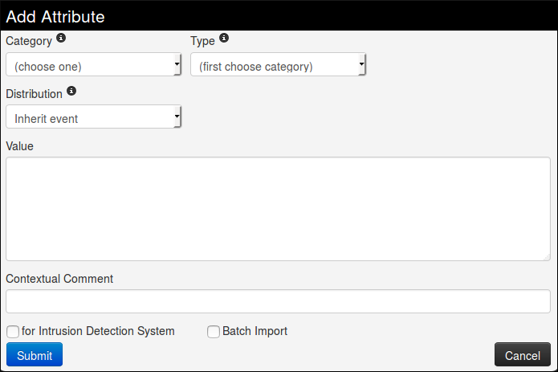

Again, we fill it with the required data.

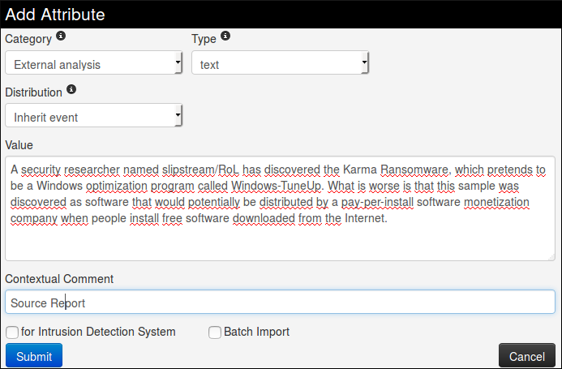

Then we submit it by clicking on the blue button
_Et voilà!_

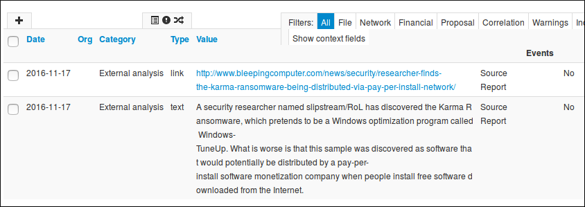

Okay, now it is time to add some Indicators of Compromise. In this report, they are mainly listed at the end.

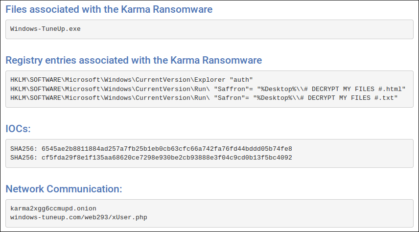

Let's try to define which category/type those IoC belong to.

First, Windows-TuneUp.exe is without a doubt a _filename_, and the associated category may be _Payload delivery_.

Second the registry entries (type _regkey_) seems to be from _Artifacts dropped_ category

Then the hashes that are already said to be _SHA 256_, and a quick test on VirusTotal also reveals that they correspond to the filename seen earlier. so we can add both as an association _filename|SHA256_. Once again, the category will be _Payload delivery_.

And finally the network communication. No doubt here for the category: _Network activity_, and the type might be _url_ but for the example, we will let MISP decide for us.

So we begin with the filename. No real change from before for this one, except that we will set the IDS flag to true.

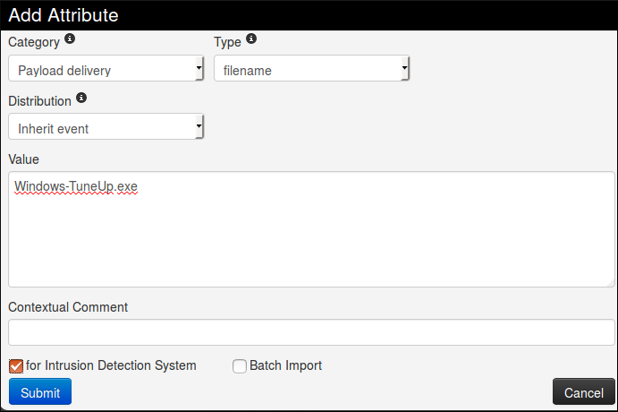

Then we can add the hashes in a similar way. We will had them both alone and combined with the filename. In order to do it quickly, we are going to use the freetext import tool, hidden there

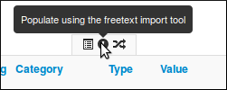

It will open a popup with a text area field where we will paste our IoC, one per line. As said previously, we add both the hashes alone and with the filename.

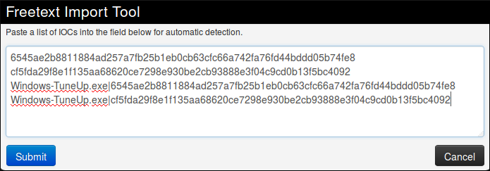

Then when we press the submit button, we are redirected on this page to control the sent data.

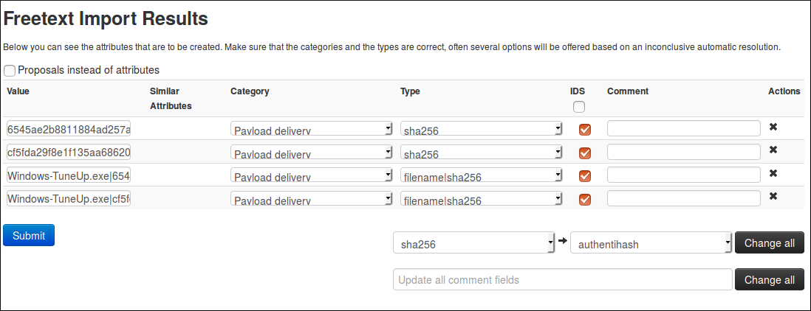

Here, MISP detected by itself what should be the category and type associated to our IoC and surprise! It matches our suppositions. Plus, it also put the IDS flag, so it is perfect. But before submitting, please double check to be sure all the values are correct and no information was lost (That can happen when the data are not formatted as expected by MISP). 

If the results of MISP were not what we expected, we can still modify it, however MISP will only suggest suitable category/type regarding the format of your data. We can change for each attribute individually or all at the same time using the option on the bottom right of the form. The same principle also applies for the comments, individually or for all.

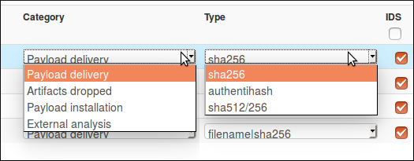  
(Yes I have two cursors, MISP is magic!)

We only have the network indicators left, and as said before, we will let MISP determined for us which type is the best for the data we have.

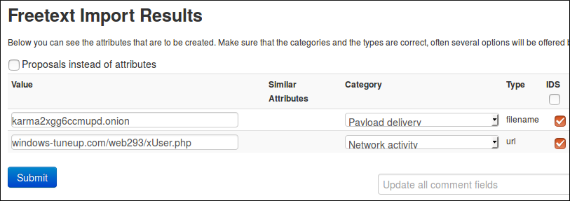

Oh well, that was unexpected. In fact, it is not that surprising regarding the format of the tor address that look more like a filename than like a url but it is still a problem, since we can't change the type nor the category to a more consistant one. This is indeed one of the limitation of freetext import. To solve this issue, we will use a simple trick: we will add a slash at the end of the tor address so it won't be confused for a filename. 

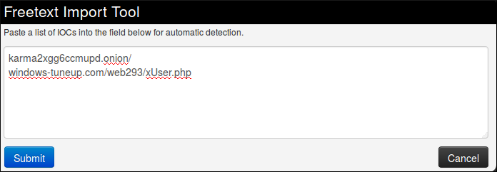

Thanks to the added character, the first string is recognised as an url which is more consistent with the reality. The second also seems okay, so we can now submit both. 

And that is all we can get for the main informations and IoC in this report. If we search more carefully, there might still be some information left in it, like the filename of the ransomnote for instance, but we will stop here for this example.
