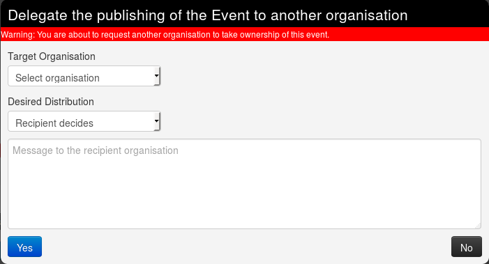
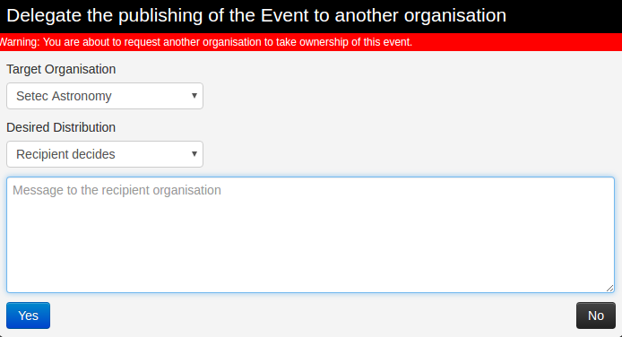
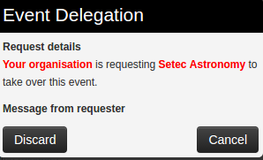

# Delegation

In information sharing, privacy of the reporting organisation can be important in such case as:

- an incident doesn't want to be linked to a potential victim.
- to avoid the relation of an organisation with the information shared.

MISP has a functionality to delegate the publication and completely remove the binding between the information shared and its organisation. If you want to publish an event without you or your organisation being tied to it, you can delegate the publication to an other organisation. That also means they will take the ownership of the event. You can only delegate to local target organisations, not any remote organisations.

> [warning] You need to have a role with "Delegation access" to delegate an event.
> 
> [warning] Also activate MISP.delegation parameter in your instance.

### Send a delegation request

To do so, you first need to put the distribution of the event as "your organisation only".  
  
Otherwise the delegation option will not be available.  
  

When the "Delegate Publishing" option is clicked, a pop-up will show up:  
  
Here you can choose 
- to which organisation you wish to delegate the event among all those registered on the server. For this example we are going to ask Setec Astronomy to publish the event for us.
- The distribution option you would like to put on the event. You can let the other organisation (called "recipient") choose if you don't mind it. For this example, we will request the recipient to share it to all communities, but it is only a suggestion, and the recipient will be able to modify the diffusion setting if wanted.  
  
- Finally you can leave a free message to the recipient organisation.
  

Once the request is sent, a message will appear on the event to remind you of your request.
  
You can also see more details by clicking on "View request details"  
  
And you can also discard the request your self, by using this pop-up or the link in the left menu.

### Answer a delegation request

As the recipient organisation, you will then receive the request of delegation. You will be notified by a red circle around the envelope on the top right of the screen.  
  
When you click it, you will be redirected as usual on the dashboard, where we can see one delegation request on the left frame.  
  
Clicking on the "view" link then redirect to an event list view showing all the events other organisations wish to delegate to your organisation. Here we only see one event, from Acme Factory.
  
And here are the metadata of the so called event.  
  
You will be able to view the details by clicking the so called link.  
  
If your role have publishing rights, you will be able to manage the delegation request by using one of the two links in the left menu.  
You can either discard it:  
  
Or accept the delegation:  
  
Please notice that the distribution desired by the requester will not automatically be set on the event, which will stay as distributed to your own organisation only if the parameter is not modified.
