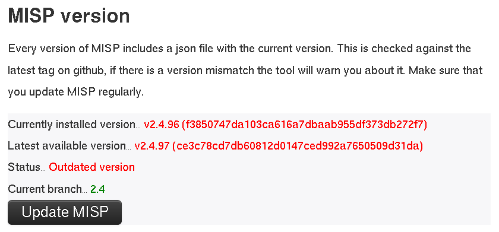
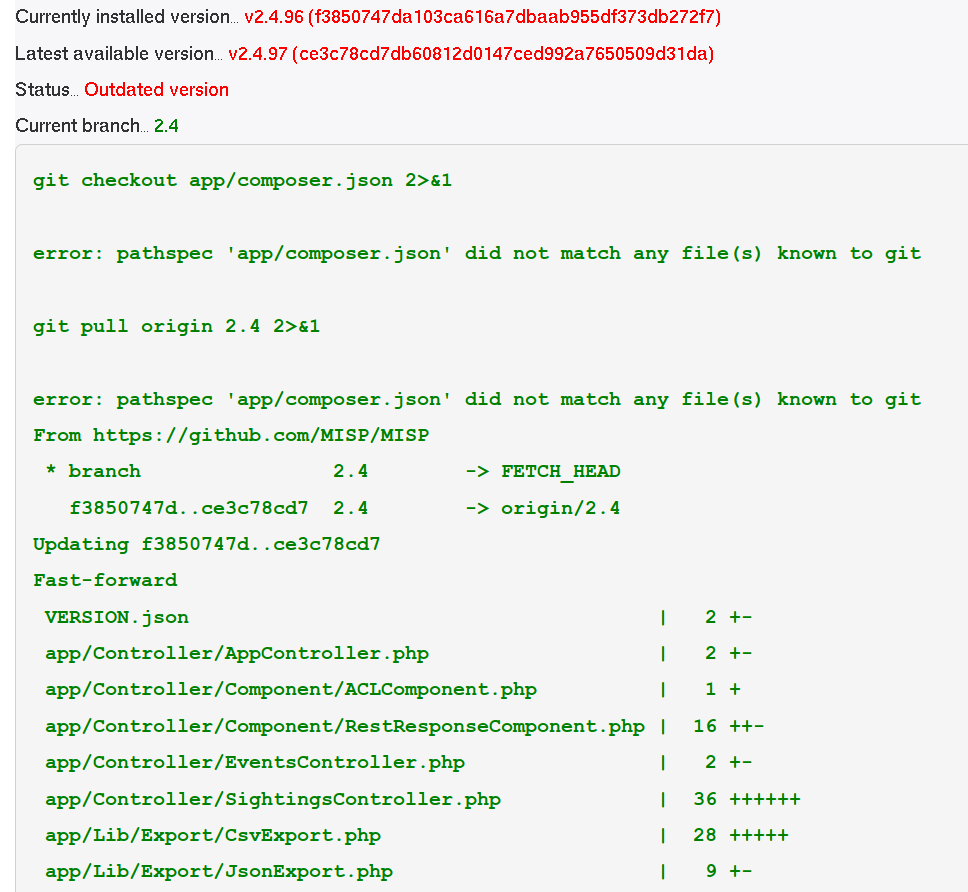

<!-- toc -->

# Frequently Asked Questions

The following page hosts most frequently asked questions as seen on our [issues](https://github.com/MISP/issues) and [gitter](https://gitter.im/MISP/MISP).

## Permission issues

If you have any permission issues, please [set the permissions](https://misp.github.io/MISP/INSTALL.ubuntu1804/#5-set-the-permissions) to something sane first.

## When to update MISP?

One question might be how often to update MISP.
You can update MISP as ofte as you like. If you see the follwing:


This means that the main repository has an update available.

If you want to play it safer or want to integrate it in your Weekly/Bi-Monthly update routine you can track our [Changelog](https://www.misp-project.org/Changelog.txt) a more up to date version is available [here](https://misp.github.io/MISP/Changelog/)


## Maintenance mode

### Is there a MISP maintenance mode?

Yes, you want to flip your instances "Live-mode".
This wants to be done on the CLI if you experience issues:

```bash
$PATH_TO_MISP/app/Console/cake "MISP.live" 0
```

Other related MISP Settings

Optional	MISP.maintenance_message	Great things are happening! MISP is undergoing maintenance, but will return shortly. You can contact the administration at $email or call CIRCL.	The message that users will see if the instance is not live.

Critical	MISP.live	true	Unless set to true, the instance will only be accessible by site admins.

## Update MISP fails

If your MISP instance is outdated, meaning ONLY the core, not the modules or dashboard or python modules, you well see the following.



Once you click on update MISP you will be asked confirmation.


If you are not on a branch, the UI will tell you this, the update will fail.


If you cannot write the **.git** files and directory as the user running the web server (and thus PHP), the update will fail.
The following diagnostic check will let you know if you can update or not.


In case you get a file not found on **.git/ORIG_HEAD**, this means that you have never updated your MISP OR you have installed git from an archive file (like .zip/.tar.gz or similar)
Try to click update MISP and see what happens.


### What can go wrong if I update MISP?

In theory nothing. We put great effort into protecting the integrity of the data stored in your MISP instance.
DB upgrades happen upon login or on reload once you have update the repository.
You cannot "break" anything by clicking **Update MISP** worse case it will complain about something and you will certainly find the answer on this page.

IF not, please open an [issue](https://github.com/MISP/MISP/issues) on GitHub or come to our [gitter](https://gitter.im/MISP/MISP) chat to see if the community can help.

### error: pathspec 'app/composer.json' did not match any file(s) known to git

This is **not** an error and can be ignore. Nothing will be impacted by this.



### MISP modules "Connection refused"


If you get have a **Connection refused state** on your modules one of the following might be true.

- You have no [misp-modules](https://github.com/MISP/misp-modules) not installed
- They are instaled but not running
- Something completly different

If they are not installed, check out this section of the [INSTALL guide](https://github.com/MISP/misp-modules/#how-to-install-and-start-misp-modules-in-a-python-virtualenv) of [misp-modules](https://github.com/MISP/misp-modules).

In case they are not running, try this on the console:

```
sudo -u www-data /var/www/MISP/venv/bin/misp-modules -l 127.0.0.1 -s &
```

OR if you were foolish enough to not install in a Python virtualenv:

```
sudo -u www-data misp-modules -l 127.0.0.1 -s &
```

> [warning] Running misp-modules like this will certainly kill it once you quit the session. Make sure it is in your **/etc/rc.local** or some ther init script that gets run on boot.

## Uninstalling MISP

There is no official procedure to uninstalling a MISP instance.

If you want to re-use a machine where MISP was installed, wipe the machine and do a fresh install.
Consider the data in your MISP instance as potentially confidential and if you synchronized with other instances, be respectful and wipe it clean.

  <!-- 
  Comment Place Holder
  -->
