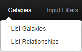
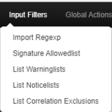
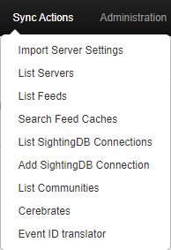
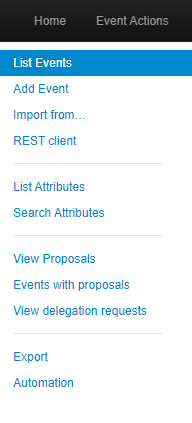

<!-- Nothing else matters -->

<!-- ToDo: Think about other default user roles that need to be considered and documented or at least hinted too. like: the role Read-only and user have these differences, if any -->

# General Layout

## The top bar
This menu contains all of the main functions of the site as a series of dropdown menus. These menus contain all (from the current user's perspective) accessible functions sorted into several groups.

### Simple User

*   **Home button:** This button will return you to the start screen of the application, which is the event index page or the page the user set as custom home page using the star in the top bar.
*   **Event Actions:** All the malware data entered into MISP is made up of an event object that is described by its connected attributes. The Event actions menu gives access to all the functionality that relates to the creation, modification, deletion, publishing, searching and listing of events and attributes.
*   **Dashboard:** Allows you to create a custom dashboard using widgets.
*   **Galaxies:** Shortcut to the list of [MISP Galaxies](../galaxy/) on the MISP instance.
*   **Input Filters:** Input filters alter what and how data can be entered into this instance. Apart from the basic validation of attribute entry by type, it is possible for the site administrators to define regular expression replacements and blocklists for certain values in addition to blocking certain values from being exportable. Users can view these replacement and blocklist rules here while an administrator can alter them.
*   **Global Actions:** This menu gives you access to information about MISP and this instance. You can view and edit your own profile, view the manual, read the news or the terms of use again, see a list of the active organisations on this instance and a histogram of their contributions by attribute type.
*   **MISP:** Simple link to your BASEURL
*   **Name:** Name (Auto generated from Mail address) of current logged in user
*   **Envelope:** Link to User Dashboard where you can consult some of your notifications and changes since last visit. Like some of the proposals received for your organisation.
*   **Log out:** The Log out button to end your session immediately.

### Admin User

*   **Home button:** See description given earlier for user.
*   **Event Actions:** See description given earlier for user.
*   **Dashboard:** See description given earlier for user.
*   **Galaxies:** You can additionally update the Galaxies.
*   **Input Filters:** See description given earlier for user.
*   **Global Actions:** See description given earlier for user.
*   **Sync Actions:** With administrator access rights, shows a list of the connected instances and allows the initiation of a push and a pull. See [sharing and synchronisation](../sharing/).
*   **Administration:** Administrators can add, edit or remove user accounts and user roles. Roles define the access rights to certain features such as publishing of events, usage of the REST interface or synchronization of any user belonging to the given role. Site administrators can also access a contact form, through which it is possible to reset the passwords of users, or to just get in touch with them via encrypted e-mails.
*   **Audit:** If you have audit permissions, you can view the logs for your organisation (or for site admins for the entire system) here or even search the logs if you are interested in something specific.
*   **MISP:** See description given earlier for user.
*   **Admin:** User role.
*   **Envelope:** See description given earlier for user.
*   **Log out:** See description given earlier for user.

### Content of each of the top menu bar drop-down menus

#### Event actions

*   **List Events:** Lists all the events in the system that are not private or belong to your organisation. You can add, modify, delete, publish or view individual events from this view.
*   **Add Event:** Allows you to fill out an event creation form and create the event object, which you can start adding attributes.
*   **List Attributes:** Lists all the attributes in the system that are not private or belong to your organisation. You can modify, delete or view each individual attribute from this view.
*   **Search Attributes:** You can set search terms for a filtered attribute index view here.
*   **REST client** MISP Online REST client where you can make calls directly to the API via a Web UI.
*   **View Proposals:** Shows a list of all proposals that you are eligible to see.
*   **Events with proposals:** Shows all of the events created by your organisation that has pending proposals.
*   **List Tags:** List all the tags that have been created by users with tag creation rights on this instance.
*   **List Tag Collections:** List all the tag collections that have been created by users with tag creation rights on this instance. Tag collections allow you to assign a collection of tags to an event or attribute in one action.
*   **Add Tag:** Create a new tag.
*   **List Taxonomies:** List all of the taxonomies installed on the MISP instance. This is also the place to activate the taxonomies as a Org Admin/Site Admin.
*   **List Templates:** List all of the event templates created by users with template creation rights on this instance.
*   **Add Template:** Create a new template.
*   **Export:** Export the data accessible to you in various formats.
*   **Automation:** If you have authentication key access, you can view how to use your key to use the REST interface for automation here.
#### Galaxies

*   **List Galaxies:** Index of [MISP Galaxies](../galaxy/) on the MISP instance.
*   **List Relationships:** Shows a list of galaxy cluster relationships.

#### Input filters

*   **Import Regexp:** You can view the Regular Expression rules, which modify the data that can be entered into the system. This can and should be used to help filter out personal information from automatic imports (such as removing the username from windows file paths), having unified representation for certain common values for easier correlation or simply standardizing certain input. It is also possible to block certain values from being inserted. As a site administrator or a user with regex permission, you can also edit these rules.
*   **Signature Allowlist:** You can view the allowlist rules, which contains the values that are blocked from being used for exports and automation on this instance. Site administrators have access to editing this list.
*  **List Warninglists:** MISP warninglists are lists of well-known indicators that can be associated to potential false positives, errors or mistakes. The warning lists are integrated in MISP to display an info/warning box at the event and attribute level.
*  **List Noticelists:** MISP noticelists inform MISP users of the legal, privacy, policy or even technical implications of using specific attributes, categories or objects.
*  **List Correlation Exclusions:** Allows for the exclusion of certain values from the correlation engine.

#### Global Actions

*   **News:** Read about the latest news regarding the MISP system
*   **My Profile:** Manage your user account.
*   **My Settings:** View your user specific settings.
*   **Set Setting:** Set user specific settings.
*   **Organisations:** View the organisations having a presence on this instance.
*   **Role Permissions:** You can view the role permissions here.
*   **List Sharing Groups:** You can view the list of existing Sharing Groups to which you or your organisation have access.
*  **Add Sharing Group:** Create a sharing group.
*  **Decaying Models Tool:** Allows you to create decaying models.
*  **List Decaying Models:** Manage existing decaying models.
*   **User Guide:** A link to this user guide.
*   **Categories & Types:** Quick overview of Attribute Categories and Types. e.g: md5 -> Payload delivery, Artifacts dropped, Payload installation, External analysis
*   **Terms & Conditions:** General terms and conditions which can be configured in Administration -> Server Settings -> MISP Settings: MISP.terms_file . From the UI: "The filename of the terms and conditions file. Make sure that the file is located in your MISP/app/files/terms directory"
*   **Statistics:** View a series of statistics about the users and the data on this instance.
*   **List Discussions:** List threads of discussions created on the MISP instance by the organisations connected to this local community.
*   **Start Discussion:** Create a new discussion thread.
<!-- #ToDo: Make a reference to best practices on how to use this form of messaging. Sense/non-sense etc... -->

#### Sync Actions

*   **Import Server Settings:** Import sync server configuration.
*   **List Servers:** Connect your MISP instance to other instances, or view and modify the currently established connections.
<!-- Include example of error message/stack trace differences. -->
*  **List Feeds:** Follow the RSS feeds of other organisation or CERTs worldwide. 
*  **Search Feed Caches:** Search for values potentially contained in the cached feeds and servers. 
*  **List SightingDB Connections:** Allows you to manage existing SightingDB connections. SightingDB is an alternate sighting database that MISP interconnects with. 
*  **Add SightingDB Connection:** Create a SightingDB connection.
*  **List Communities:** A list of communities that chose to advertise their existence to the general MISP user-base.
*  **Cerebrates:** Connect your MISP to one or several Cerebrate instances to act as lookup directories for organisation and sharing group information.
*  **Event ID translator:** Allows to translate a local ID into the corresponding event ID on sync servers configured.

#### Administration

*   **List Users:** View, modify or delete the currently registered users.
*   **List Auth Keys:** Shows a list of the auth keys on this instance (auth keys from the advanced auth key system) with their comments.
*   **List User Setting:** Lists user setting for the users on this instance.
*   **Set User Setting:** Set user specific settings for the users on this instance.
*   **Add User:** Create an account for a new user for your organisation. Site administrators can create users for any organisation.
*  **Contact Users:** You can use this view to send messages to your current or future users or send them a temporary password.

When adding a new user to the system, or when you want to manually reset the password for a user, just use the "Send credentials automatically" setting.

After selecting the action, choose who the target of the e-mails should be (all users, a single user or a user not yet in the system).

You can then specify (if eligible) what the e-mail address of the target is (for existing users you can choose from a dropdown menu).

In the case of a new user, you can specify the future user's GnuPG key, to send his/her new key in an encrypted e-mail.

The system will automatically generate a message for you, but it is also possible to write a custom message if you tick the check-box, don't worry about assigning a temporary password manually. The system will do that for you, it will be in the mail after your custom message.

*  **User Registrations:** You can find messages sent to this instance in this view.
*  **List Organisations:** View the organisations having a presence on this instance, with some useful information.
*  **Add Organisations:**
*   **List Roles:** List, modify or delete currently existing roles.
*   **Add Role:** Create a new role group for the users of this instance, controlling their privileges to create, modify, delete and to publish events and to access certain features such as the logs or automation.
*   **Server Settings & Maintenance:** Various tools, upgrade scripts that can help a site-admin run the instance & Set up and diagnose your MISP installation.
*   **Jobs:** View the background jobs and their progress
*   **Scheduled Tasks:** Schedule the pre-defined tasks for your instance (this currently includes export caching, server pull and server push).
*   **Event Block Rules:** Set event block rules. Event block rules allow you to add a simple tag filter to block events from being added or synced. See [administration](../administration/).
*   **Blocklist Event:** Link to form where you can quickly add an event to a blocklist with it's UUID. For more information, see [administration](../administration/).
*   **Manage Event Blocklists:** List of blocklisted events on MISP instance.
*   **blocklist Organisation:** Link to for where you can quickly add an organisation to a blocklist with it's UUID. For more information, see [administration](../administration/).
*   **Manage Org blocklists:** List of blocklisted Organisations on this instance.

#### Audit

*   **List Logs:** View the logs of the instance.
*   **Search Logs:** Search the logs by various attributes.

## The left bar
The menu items in this menu bar are different depending on the current page you are on. The blue highlight shows you what page you are on.

