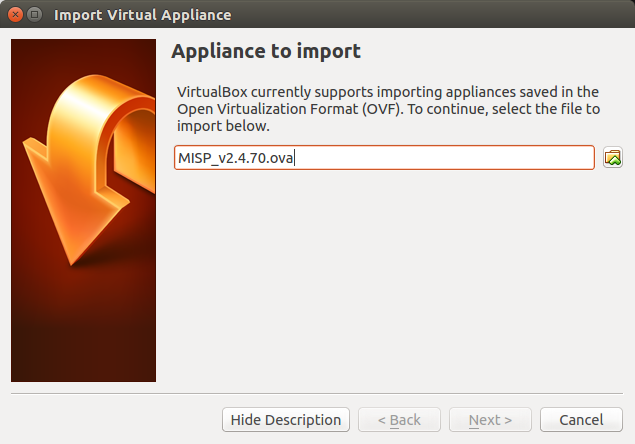
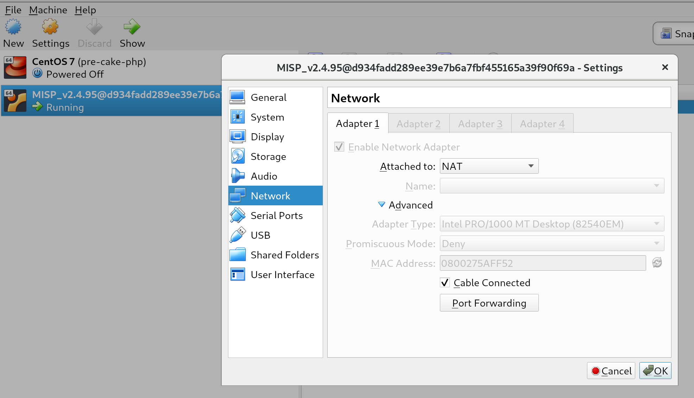
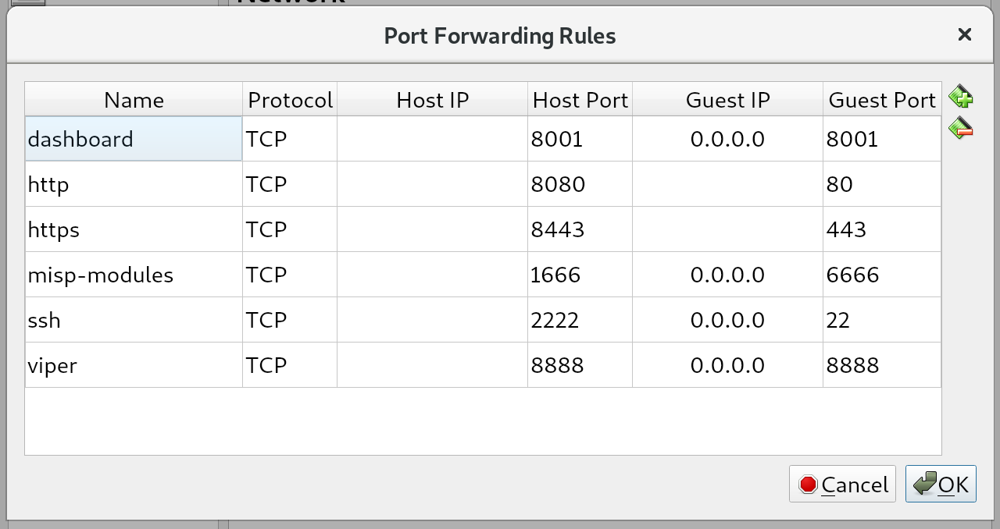

## Get your own MISP instance

The intention of this chapter is to support you in getting your own MISP instance up and running.

### MISP Virtual Machine

CIRCL maintains the image of a recent MISP virtual machine online. This VM is generated after every commit to the main MISP repository on Github.

This is a very easy out of the box solution, optimized for product evaluation and to support trainings held by CIRCL staff.

#### MISP VM Download

The best place to get the latest version of the MISP virtual machine, as well as all the available training materials is the [MISP training materials page] [1] on the CIRCL website.

If you do not remember the direct link to the MISP training materials here are the very easy to remember steps you have to follow to reach the right place:

1. Access the [CIRCL homepage] [2]
2. Navigate to the [Training area] [3]
3. Click [MISP Malware Information Sharing Platform - Threat Sharing] [4]
4. Follow the link to the [Training materials freely available] [1]

Download the image of the virtual machine and validate the SHA512 fingerprint.

#### Import Appliance

In VirtualBox use the "Import Appliance..." functionality to import the virtual machine.

The instructions in this manual covers VirtualBox only. If you prefer another virtualization solution like VMWare you can find some quick instruction on the [MISP training materials page] [1].

ESXi Servers have been tested too. Should work without problem but some manual changing of the ATA-Bus is needed.

#### MISP VM Credentials

The MISP image is pre-configured to be reachable on the private IP address **localhost** by SSH on port 2222. The GUI is reachable by **http://localhost:8080/**.

You should have two interfaces on your VirtualBox configuration (NAT and host-only). You can also configure access to the MISP instance by doing port forwarding on the NAT interface.

MISP credentials:

*   **GUI Admin:** admin@admin.test:admin  (it's the site admin account with full rights, feel free to create other users)
*   **Shell/SSH:** misp : Password1234
*   **MySQL:**     The credentials are generated during the VM generator. The details are located in ~misp/mysql.txt

#### Networking on the VM

Virtualbox has a neat feature to forward ports from your Host machine to the Guest VM.
We forward the following ports:

* **ssh** Forward from 2222 on Host -> 22 on guest
* **http** Main WebUI - 8080 on Host -> 80 on guest
* **https** Not in use - 8443 on Host -> 443 on guest
* **8001** MISP Dashboard - 8001 on Host -> 8001 on guest
* **8888** Viper Web UI - 8888 on Host -> 8888 on guest
* **1666** misp-modules used to poll the misp-modules API - 1666 on Host -> 6666 on guest

If the port is already used on your host, virtualbox will still boot and all the other ports will work.

To change the port forwarding select the running VM in the UI and click on `Settings` -> `Network` -> `Advanced` -> `Port forwarding`

Overview of default port forwards

The reason that some entries have `0.0.0.0` and other are left blank is due to a virtualbox bug where traffic would not be sent to the Guest VM.

:warning: VMWare users will need to connect to whatever IP the VM has on your host. There is NO port forwarding done fo r VMWare.

#### Potential issues

You might have a very old VM installed and the ports are not be forwarded.
Either configure the port forwards manually or download a new VM.

[1]: https://www.circl.lu/services/misp-training-materials/ "MISP training materials page"
[2]: https://www.circl.lu/ "CIRCL homepage"
[3]: https://www.circl.lu/services/training/ "Training area"
[4]: https://www.circl.lu/services/training/#misp-malware-information-sharing-platform-threat-sharing "Malware Information Sharing Platform"