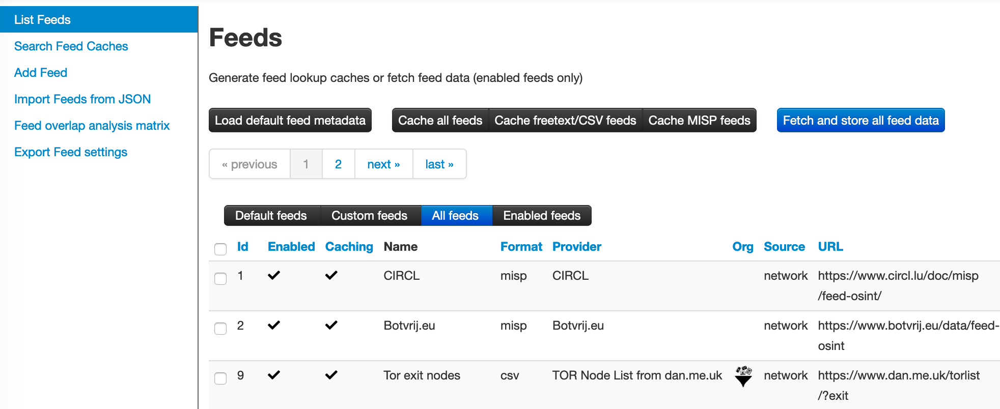
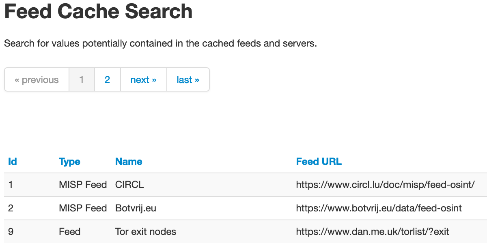
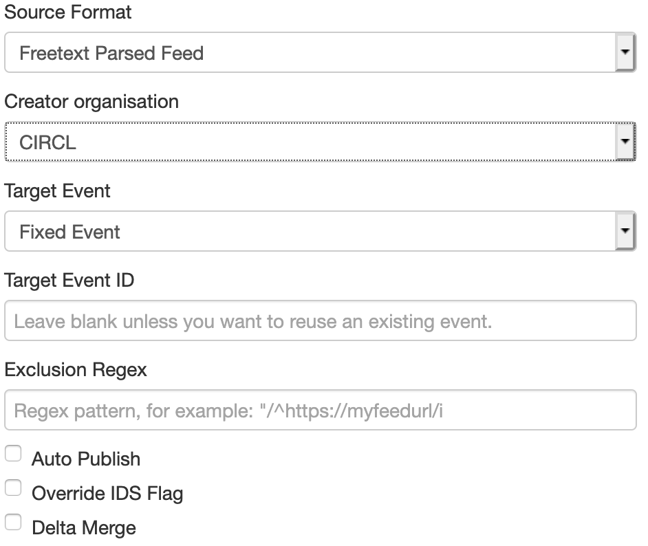
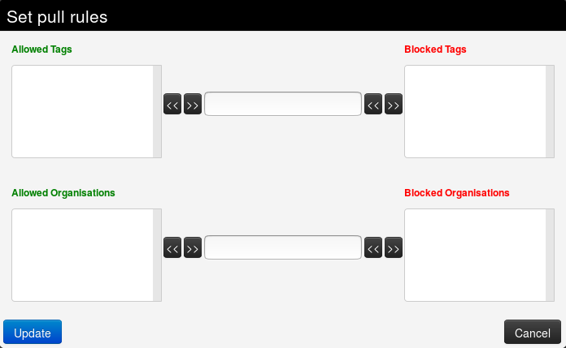
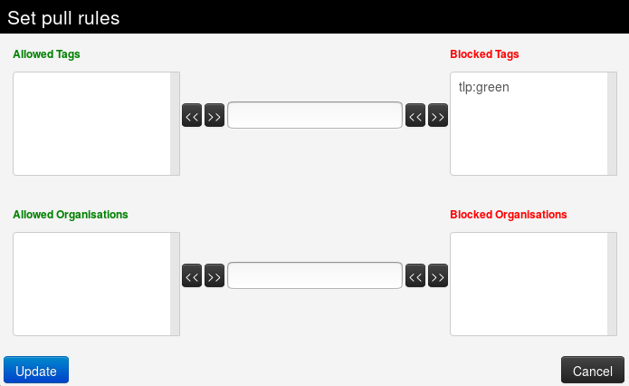
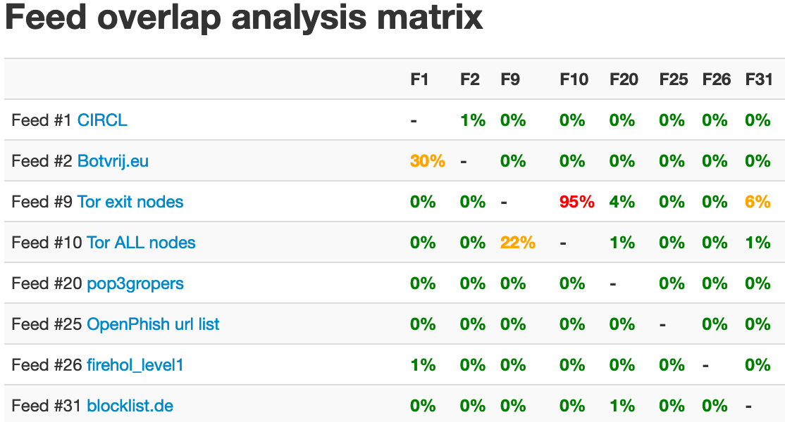

<!-- toc -->

# Feeds

Feeds are remote or local resources containing indicators that can be automatically imported into MISP at regular intervals.
Feeds can be structured in MISP format, CSV format or even free-text format. You can easily import any remote or local URL
to store the data in your MISP instance. It's a simple way to gather many external sources of information into MISP without any programming skills.

Feed descriptions can be also easily shared among different MISP instances as you can export a feed description as JSON 
and import it back in another MISP instance.

## Managing feeds

>[warning] A site admin role is required to perform these actions.

To manage feeds you first need to access the Feeds page using the List Feeds item on the top menu:

Then you will see the Feeds page with a table of configured feeds.

### Default feeds

The MISP project supplies a list of open-source feeds.  You can load these feed definitions by using the 'Load default feed metadata' button on the Feeds page.  This feature creates new feeds by importing the entries in file app/files/feed-metadata/defaults.json to the database. Existing feeds are not changed. The feature checks for duplicates using the feed URL. If a feed with the same URL already exists in the database, that entry is not imported. This ensures that
local modifications such as name, distribution or enabled status are never overwritten.

### Caching feeds

 Caching downloads the feed content to the Redis server in your instance, and allows you to correlate attributes and see matching "Feed hits" (similar to correlated "Related Events") in the event view on each attribute row.  Caching does not create any events in the database server in your instance.

Use the buttons at the top of the Feeds screen to retrieve data from feeds and store the data in the Redis cache. The buttons let you cache data from all feeds, cache data from freetext/CSV-format feeds only, or cache data from MISP-format feeds only.

### Fetching feeds

Use the button at the top right of the Feeds screen to fetch data from all feeds and ingest the data to the MISP database.

### Search feed caches

To search the feed caches, select the Search Feed Caches option on the side menu. This displays a table where you can search for values potentially contained in the cached feeds and servers.

### Adding feeds

To add a new feed, select the Add Feed option on the side menu.
Here you will have access to a dynamic form. Let's check each field by order. The form shows or hides fields based on the selections in the drop-down fields.

* Enabled: Is the feed active or not
* Caching enabled: Should the feed data be cached
* Lookup visible: If this is not checked, correlations will only show up for you; if checked, correlations are visible for other users as well
* Name: Name to identify the feed; not required to be unique
* Provider: Name of the content provider
* Input Source: Where does the input come from  
  
  * Network: hosted somewhere outside the platform
  * Local: Hosted on the local server. In this case, a new checkbox "Remove input after ingestion" will appear. If checked, the source is deleted after usage.  

* URL: URL of the feed, where it is located (for Local hosted files, point to the manifest.json; e.g., /home/user/feed-generator/output/manifest.json)

* The Source Format can be:  

  * MISP Feed: The source points to a list of JSON formatted files like MISP events.  
  Example: https://www.circl.lu/doc/misp/feed-osint

  * Freetext Parsed Feed: The options for a freetext-parsed feed are shown below.

    * Creator organisation: The creator organisation (orgc_id) for the event created from this feed. Appears in the Org column on the List Feeds screen.
    * Target Event: The event to hold data from the feed. Can be either "New Event Each Pull" (a new event will be created each time the feed is pulled) or "Fixed Event" (a unique event will be updated with the new data, as determined by the next field).
  
    * Target Event ID: The ID of the event where the data will be added; if not set, the field will be set the first time the feed is fetched.
    * Exclusion Regex: Add a regex pattern for detecting IoCs that should be skipped. This can be useful to exclude any references to the actual report / feed for example.
    * Auto Publish: If checked, the event created from the feed will be automatically published
    * Override IDS Flag: If checked, the IDS flag will be set to false
    * Delta Merge: If checked, only attributes from the most recent fetch are kept, the old ones are (soft-) deleted.

  * Simple CSV Parsed Feed: The options for a chacter-separated feed are shown below.
  
    * Creator organisation: The creator organisation (orgc_id) for the event created from this feed. Appears in the Org column on the List Feeds screen.
    * Target Event: The event to hold data from the feed. Can be either "New Event Each Pull" (a new event will be created each time the feed is pulled) or "Fixed Event" (a unique event will be updated with the new data, as determined by the next field).
    * Target Event ID: The ID of the event where the data will be added; if not set, the field will be set the first time the feed is fetched.
    * Value field(s) in the CSV: Select one or several fields that should be parsed by the CSV parser and converted into MISP attributes; specify column position separated by commas
    * Delimiter: Set the field separator; default is comma ","
    * Exclusion Regex: Add a regex pattern for detecting IoCs that should be skipped. This can be useful to exclude any references to the actual report / feed for example.
    * Auto Publish: If checked, the event created from the feed will be automatically published
    * Override IDS Flag: If checked, the IDS flag will be set to false
    * Delta Merge: If checked, only attributes from the most recent fetch are kept, the old ones are (soft-) deleted.

* Distribution: The distribution option that will be set on the event created from the feed. The choices are:
  * Your organisation only
  * This community only
  * Connected communities
  * All communities
  * Sharing Group. In this case, a new field Sharing Group appears where you must select a group.

* Default Tag: A default tag can be added to the created event(s)

* Filter rules: Here you can define which tags or organisations are allowed or blocked.  

To add a tag (or organisation respectively), first type it into the top middle (bottom middle for organisation) text field. Then use the arrows that point to the outside to add it to the allowed or blocked tags (or organisations respectively) list.  
  

To remove a tag (or organisation respectively), select it in the list and click on the arrow pointing to the inside.  
  

### Importing feeds

To import a new feed, select the Import Feeds from JSON option on the side menu. Paste MISP feed metadata JSON into the text box and click the Add button. Double check values in ID fields that are specific to an instance including the feed ID (field id), event ID (field event_id), organisation ID (field orgc_id), sharing group ID (field sharing_group_id) and tag ID (field tag_id).

### Analyze feed overlap

To analyze feed data overlap, select the Feed overlap analysis matrix option on the side menu. This presents overlap matrix obtained by analyzing cached feed data.

### Exporting feeds

To export all feed metadata, select the Export Feeds settings option on the side menu. The server will push a JSON file for download.

## Feed correlation

If an indicator from a feed matches an indicator within a MISP event, it will show up as "Feed hits" in the event overview.
The correlation will not show up in the correlation graph of the event.

