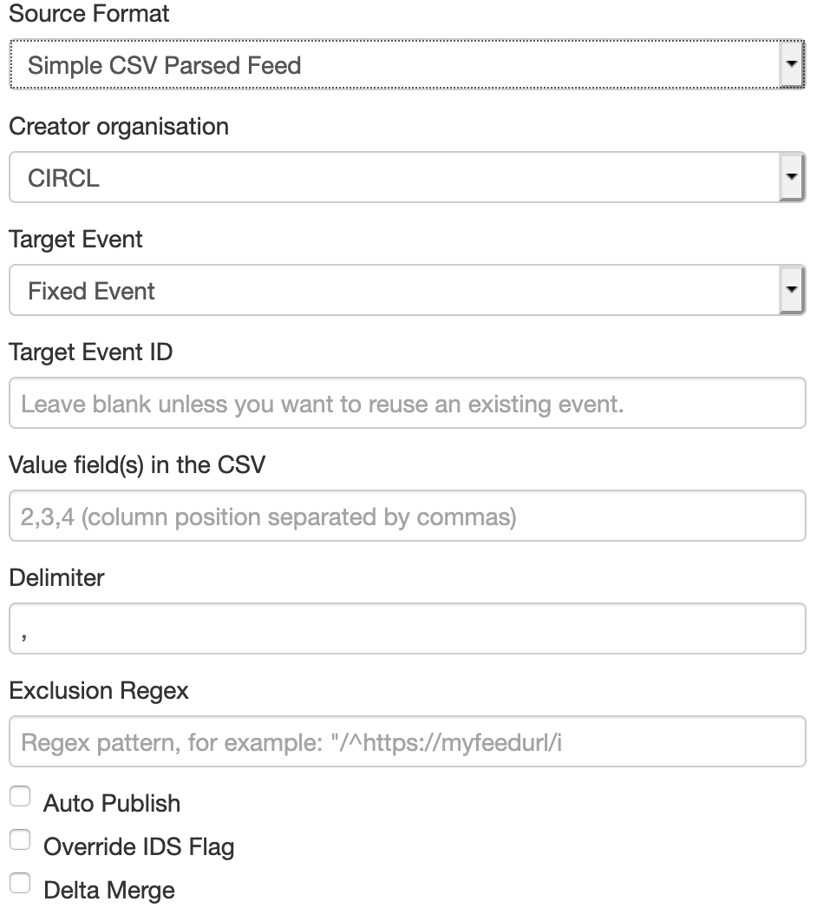
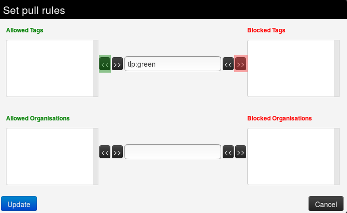
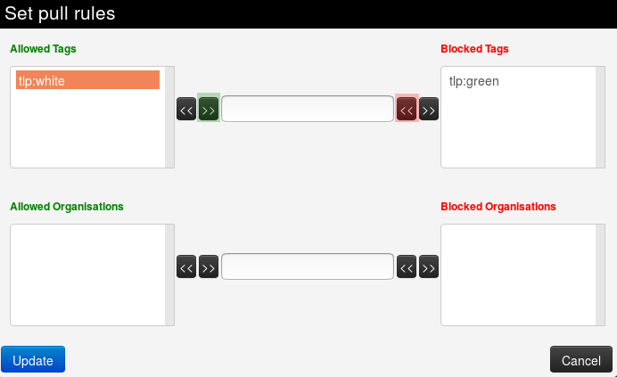

<!-- toc -->

# Feeds

Feeds are remote or local resources containing indicators that can be automatically imported in MISP at regular intervals.
Feeds can be structured in MISP format, CSV format or even free-text format. You can easily import any remote or local URL
to store them in your MISP instance. It's a simple way to gather many external sources of information without any programming skills
into MISP.

Feeds description can be also easily shared among different MISP instances as you can export a feed description as JSON 
and import it back in another MISP instance.

## Managing feeds

>[warning] A site admin role is required to perform these actions.

To do so, you first need to access the list of feeds, using the top menu.

### Adding feeds

Then select the add feed option on the side menu.

Here you will have access to a dynamic form. Let's check each field by order.

* Enabled: Is the feed active or not
* Lookup Visible: If this is not checked, the correlation will only show up to you, if checked, correlations are visible for other users as well
* Name: Just a name to identify the feed
* Provider: Name of the content provider
* Input Source: Where does the input come from  
  
  * Network: hosted somewhere outside the platform
  * Local: Hosted on the local server. On this case, a new checkbox "Remove input after ingestion" will appear. If checked, the source is deleted after usage.  

* Url: Url of the feed, where it is located (for Local hosted files, point to the manifest.json e.g. /home/user/feed-generator/output/manifest.json)

* The Source Format can be:  

  * MISP Feed: The source points to a list of json formated like MISP events.  
  Example: https://www.circl.lu/doc/misp/feed-osint

  * Freetext Parsed Feed:  

    * Target Event: Which will be the event getting updated with the data from the feed. Can be either "New Event Each Pull" (A new event will be created each time the feed is pulled) or "Fixed Event" (A unique event will be updated with the new data. This event is determined by the next field)  
  
    * Target Event ID: The id of the event where the data will be added (if not set, the field will be set the first time the feed is fetched) 
    * Exclusion Regex: Add a regex pattern for detecting iocs that should be skipped (this can be useful to exclude any references to the actual report / feed for example)
    * Auto Publish: If checked, events created thanks to the feed will be automatically published
    * Override IDS Flag: If checked, the IDS flag will be set to false
    * Delta Merge: If checked, only data coming from the last fetch are kept, the old ones are deleted.

  * Simple CSV Parsed Feed:  
  
    * Target Event: Which will be the event getting updated with the data from the feed. Can be either "New Event Each Pull" (A new event will be created each time the feed is pulled) or "Fixed Event" (A unique event will be updated with the new data. This event is determined by the next field)  
    * Target Event ID: The id of the event where the data will be added (if not set, the field will be set the first time the feed is fetched) 
    * Exclusion Regex: Add a regex pattern for detecting iocs that should be skipped (this can be useful to exclude any references to the actual report / feed for example)
    * Value field(s) in the CSV: Select one or several fields that should be parsed by the CSV parser and converted into MISP attributes
    * Delimiter: Set the default CSV delimiter (default = ",")
    * Auto Publish: If checked, events created thanks to the feed will be automatically published
    * Override IDS Flag: If checked, the IDS flag will be set to false
    * Delta Merge: If checked, only data coming from the last fetch are kept, the old ones are deleted.

* Distribution: Define the distribution option that will be set on the event created by the feed

* Default Tag: A default tag can be added to the created event(s)

* Filter rules: Here you can define which tags or organisations are allowed or blocked.  

To add a tag (resp. organisation), first type it into the top middle (resp. bottom middle) text field . Then use the arrows that point to the outside to add it to the allowed or blocked tags (resp. organisations) list.  
  

To remove a tag (resp. organisation), select it in the list and click on the arrow pointing to the inside.  
  

## Feed correlation

If an indicator from an feed matches an indicator within a MISP event, it will show up as "Feed hits" in the event overview.
The correlation will not show up in the correlation graph of the event.

## Default feeds

The MISP project supplies a list of open-source feeds.  You can load these feed definitions
by using the 'Load default feed metadata' feature on the Feeds page.  This feature creates new
feeds by importing the entries in file app/files/feed-metadata/defaults.json to the database.
Existing feeds are not changed. The feature checks for duplicates using the feed URL. If a feed
with the same URL already exists in the database, that entry is not imported. This ensures that
local modifications such as name, distribution or enabled status are never overwritten.
