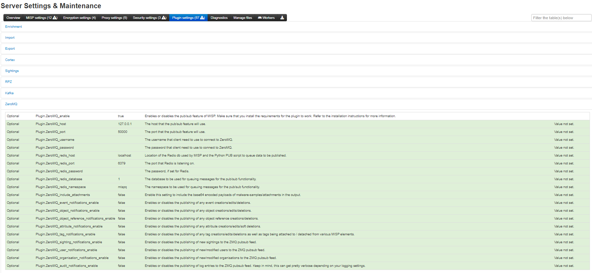

<!-- toc -->

## MISP ZeroMQ

MISP includes a flexible publish-subscribe model to allow real-time integration of the MISP activities (event publication, attribute creation or removal, sighting).
The MISP ZeroMQ plugin operates at global level in MISP which means standard distribution rules don't apply and every activities will be published within the ZeroMQ pub-sub
channels.

MISP ZeroMQ functionality can be used for various model of integration or to extend MISP functionalities:

- real-time search of indicators into a SIEM
- automatic expansion
- dashboard activities
- logging mechanisms
- continuous indexing
- custom software or scripting

The following notification types exist and can be included in the MISP ZeroMQ pub-sub:

- `misp_json` - messages related to events published
- `misp_json_attribute` - messages related to attribute updated or created
- `misp_json_sighting` - messages related to sighting added to an attribute or an event
- `misp_json_user` - messages related to user updates or creation
- `misp_json_organisation` - messages related to organisation updates or creation

### MISP ZeroMQ configuration

To enable MISP ZeroMQ, the feature must be enabled in the Plugin setting tab.

Each notification channels can be enabled (from event publication to sightings), the MISP site admin can decide which type of message to publish.

By default, the ZMQ pub-sub channel is available to localhost only on TCP port 50000. The binding of the pub-sub channel can be updated in the
configuration interface as shown above

### MISP ZeroMQ debugging and testing

In the diagnostic section, ZeroMQ service can be started and stopped. There is a small status option to give
information about the numbers of events processed by the service.

### Testing with sub.py tool

A simple command line tool is included with MISP to connect to the MISP ZeroMQ channel and get the notifications:

~~~~
python3 sub.py --help
usage: sub.py [-h] [-s] [-p PORT] [-r HOST] [-o ONLY] [-t SLEEP]

Generic ZMQ client to gather events, attributes and sighting updates from a
MISP instance

optional arguments:
  -h, --help            show this help message and exit
  -s, --stats           print regular statistics on stderr
  -p PORT, --port PORT  set TCP port of the MISP ZMQ (default: 50000)
  -r HOST, --host HOST  set host of the MISP ZMQ (default: 127.0.0.1)
  -o ONLY, --only ONLY  set filter (misp_json, misp_json_attribute or
                        misp_json_sighting) to limit the output a specific
                        type (default: no filter)
  -t SLEEP, --sleep SLEEP
                        sleep time (default: 2)
~~~~

