<!-- This is a comment.
And Justice for All! -->

# Quick Start

MISP (Open Source Threat Intelligence and Sharing Platform) software facilitates the exchange and sharing of threat intelligence, Indicators of Compromise (IoCs) about targeted malware and attacks, financial fraud or any intelligence within your community of trusted members. MISP sharing is a distributed model containing technical and non-technical information which can be shared within closed, semi-private or open communities. Exchanging such information should result in faster detection of targeted attacks and improve the detection ratio, whilst also reducing the number of false positives.

With the focus on automation and standards, MISP provides you with a powerful ReST API, extensibility (via misp-modules) or additional libraries such as PyMISP, jump ahead to these chapters to get started.

## Login into MISP

MISP default credentials:
<table>
<tr>
  <td>Username:</td>
  <td>admin@admin.test</td>
</tr>
<tr>
  <td>Password:</td>
  <td>admin</td>
</tr>
</table>

## I forgot my admin password :(

You can quickly reset it via the command line. You need to know the Admins E-Mail address.
Replace www-data with whoever runs the webserver.

```
sudo -u www-data /var/www/MISP/app/Console/cake Password admin@admin.test Password1234
```

## Tasks to do after first Start

<!-- TODO: Consollidate all sources to misp-book -->
1. [Change site admin password](https://www.circl.lu/doc/misp/quick-start/#password-policy)
2. [Activate Feeds](https://www.circl.lu/doc/misp/managing-feeds/)
3. [Setup your User](https://www.circl.lu/doc/misp/user-management/#first-run-of-the-system)
3.1 Designate a Site Admin and an Org Admin
3.2 Add some contributing users and assign the corresponding Roles
4. [MISP Administration](https://www.circl.lu/doc/misp/administration/)
4.1 Edit your first organisations' name

## Password Policy 
- [12]: Ensure that the password is at least 12 characters long
- [A-Z]: contains at least one upper-case
- [0-9| ]: includes a digit or a special character 
- [a-z]: at least one lower-case character.

If you need a password generator use:
- Ubuntu / Debian: [pwgen](https://linux.die.net/man/1/pwgen)
- Website: [LastPass PW Generator](https://lastpass.com/generatepassword.php)
- Built-in generator in Keepass* and other passwort manager
- Built-in generator in various web browsers

**All Generator tools are only possibilities without any guarantee!**

<div class="pagebreak"></div>

## tl;dr

### Create an Event
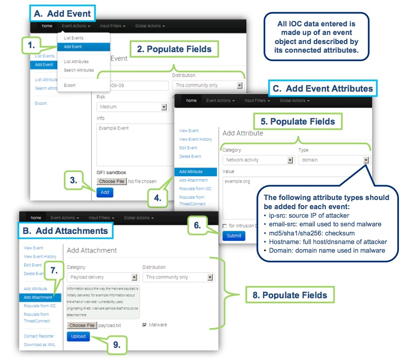

### Browse Past Events
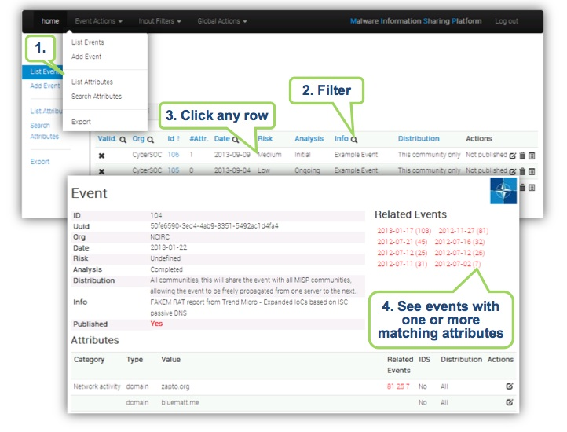

### Export Events for logsearches
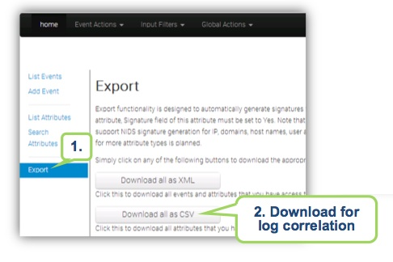

<div class="pagebreak"></div>

## Create an Event


You only have to add a few pieces of information to register your Event. Further details will be specified after the Event has been added.

## Describe Event

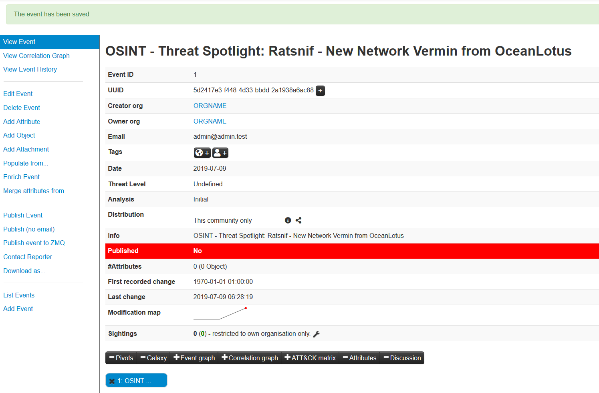

Now you can specify the information for your Event (you will need to scroll the window).

### Free-Text Import Tool

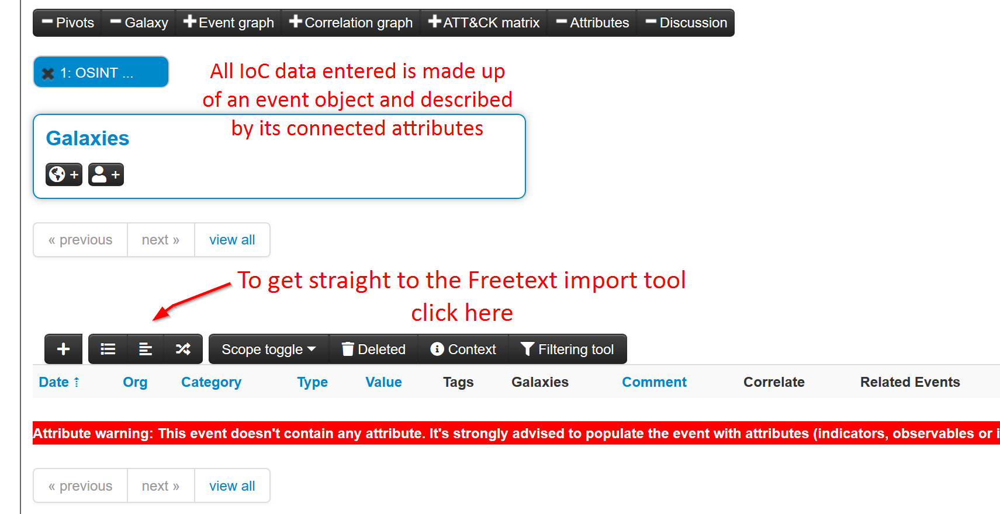

The following will pop-up.

If you have a list of indicators from which you would like to quickly generate attributes then the **Free-text import tool** is
just what you need. Simply paste your list of indicators (separated by line-breaks) into this tool.

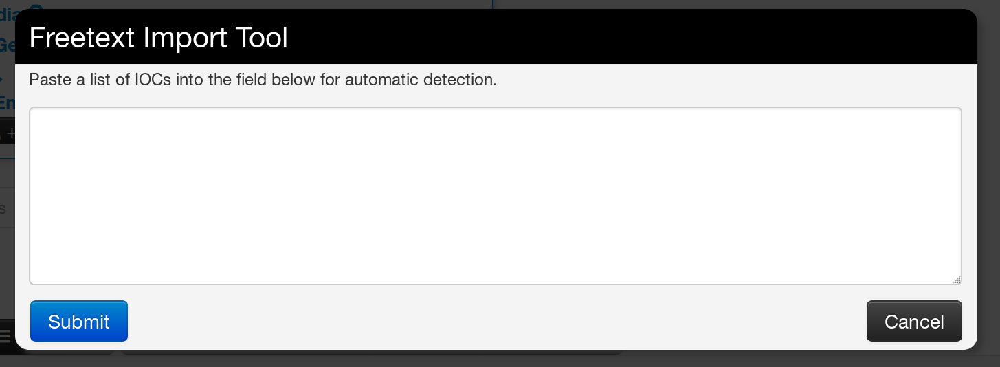

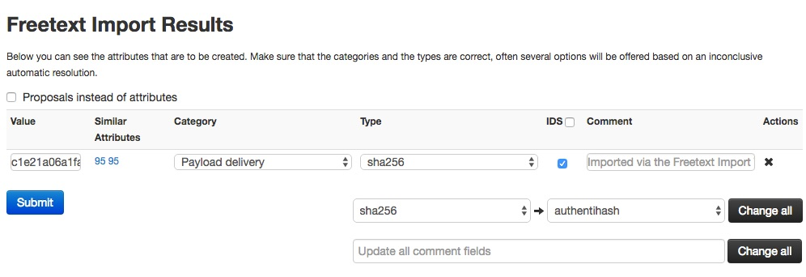

The tool will help you to find similarities between your import and other issues already registered in MISP.

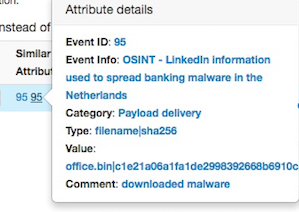

For example, you can see the ID of all related Events and view their information.

##### Alternative to import

An alternative route to reach the Freetext import tool is shown below.


### Tags and Taglist

#### Using existing Data

Another easy way to add information is to use Tags. You can see the result of adding existing Tags (circl:incident-classification=XSS ans circl:incident-classification="information-leak).

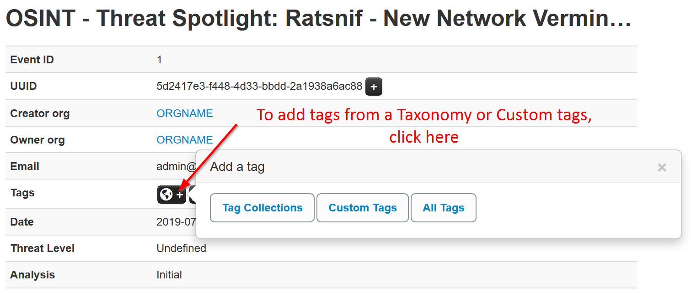

By clicking the button, you can add more tags from an existing Taglist.


In particular the "Taxonomy Library: circl" Taglist is very complete.

Once you added the tag(s) it will show in you main event window and in the list event view.


### Local tags

Local tags can be added in a similar fashion.

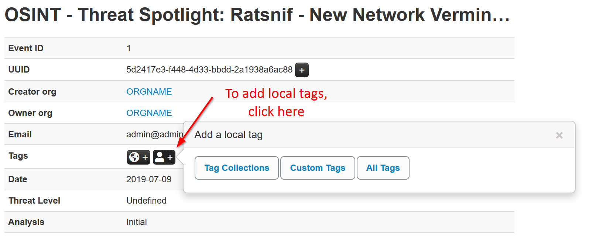

They will be identified by a corresponding icon.


#### No tags in list

In case you get the below. You need to either enable an existing Taxonomy or add some custom tags.

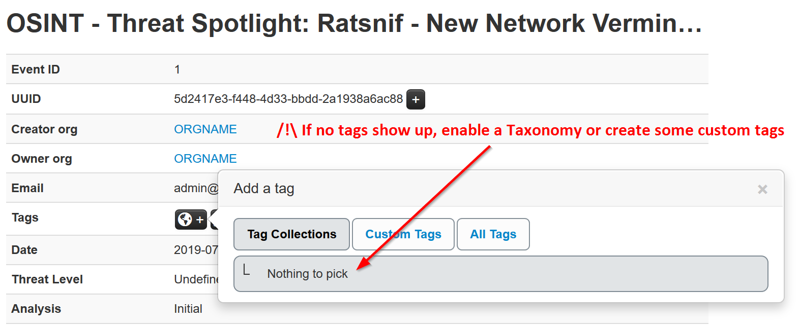

#### Make your own Taglist

If you want make your own Taglist, select Add Tag.


You will see the following window:


Then, when you add the new tag it will appear in the Custom Taglist.

### Suggestions

The following attribute types should be added for each Event:
- ip-src: source IP of attacker
- email-src: email used to send malware
- md5/sha1/sha256: checksum
- Hostname: full host/dnsname of attacker
- Domain: domain name used in malware

## Browsing Events
To see your Event, select List Events from the menu Events Action. You can click any row and select a filter.


If you click on your Event's number, you can see all the information related to your Event.


## Export Events for Log Search

Export functionality is designed to automatically generate signatures for intrusion detection systems. To enable signature generation for a given attribute, the Signature field of this attribute must be set to Yes. Note that not all attribute types are applicable for signature generation, currently we only support NIDS signature generation for IP, domains, host names, user agents etc., and hash list generation for MD5/SHA1 values of file artifacts. Support for more attribute types is planned.

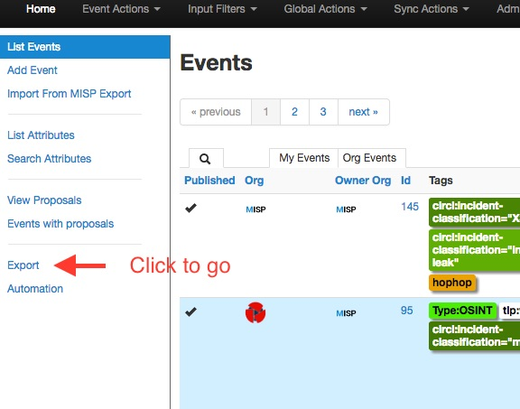

Simply click on any of the following buttons to download the appropriate data for log correlation.


## Enable a Taxonomy

## Enable and fetch a feeds
