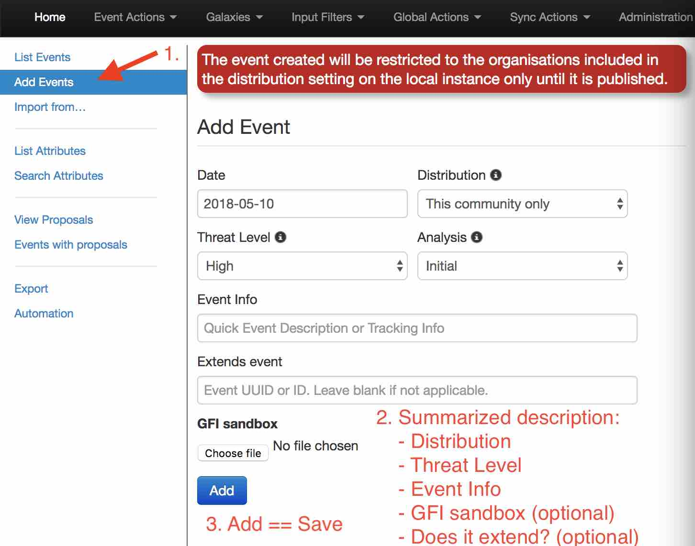
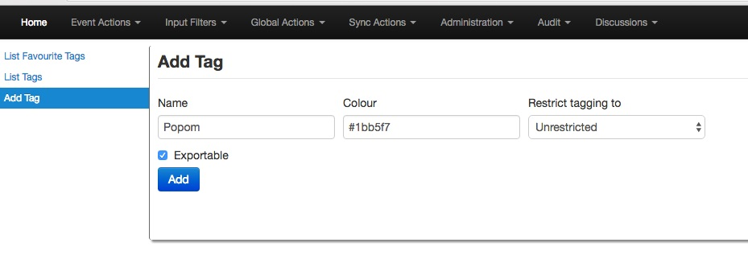

<!-- This is a comment.
And Justice for All! -->

# Quick Start

The Malware Information Sharing Platform (MISP) is the tool which will be used to facilitate the exchange of Indicator of Compromise (IOC) about targeted malware and attacks within your community of trusted members. It is a distributed Indicator of Compromise (IOC) database with technical and non-technical information. Exchanging this information should result in faster detection of targeted attacks and improve the detection ratio, while also reducing the number of false positives.

## Create an Event

You have only few infos to put in to register your Event. Details will be specified after adding your Event.

## Describe Event

Red is fully normal. No worries.

You can now specify the information for your Event. (You must scroll the window).

### Free-Text Import Tool

If you have a list of indicators that you would like to quickly generate attributes out of then the **Free-text import tool** is
just what you need. Simply paste a list of indicators (separated by line-breaks into this tool).

The Tool will help you to find similarities and other issues already registered in MISP.

For example, you can see the number of related events and informations.

### Tags and Taglist

#### Using existing Data

An other easy way to add information, is to use Tags, because you will find some Taglist. You can see the result of adding existing Tags (circl:incident-classification=XSS ans circl:incident-classification="information-leak).

By clicking the bottom, you can add other tag from existing Taglist.

Especially, the Taglist "Taxonomy Library: circl" is very complete, as you can see:

#### Make your own Taglist

If you want make your own Taglist, you should select Add Tag

you will then see the following window:

Then when you want to add the new tag , it will appear among the Custom Taglist.

### Suggestions

The following attribute types should be added for each event:
- ip-src: source IP of attacker
- email-src: email used to send malware
- md5/sha1/sha256: checksum
- Hostname: full host/dnsname of attacker
- Domain: domain name used in malware

## Browsing Events
To see your Event, select List Events from the menu Events Action and choice List Events. You can click any row and select filter.

If you click to your event's number, you can see all informations related to your Event.

## Export Events for Log Search

Export functionality is designed to automatically generate signatures for intrusion detection systems. To enable signature generation for a given attribute, Signature field of this attribute must be set to Yes. Note that not all attribute types are applicable for signature generation, currently we only support NIDS signature generation for IP, domains, host names, user agents etc., and hash list generation for MD5/SHA1 values of file artifacts. Support for more attribute types is planned.

Simply click on any of the following buttons to download the appropriate data and download for log correlation.

