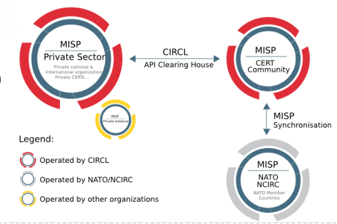
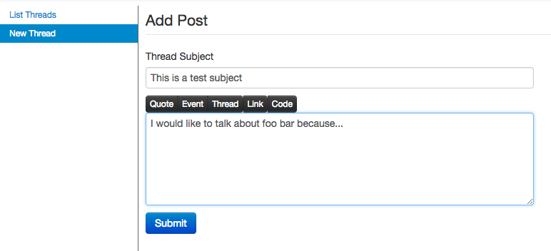
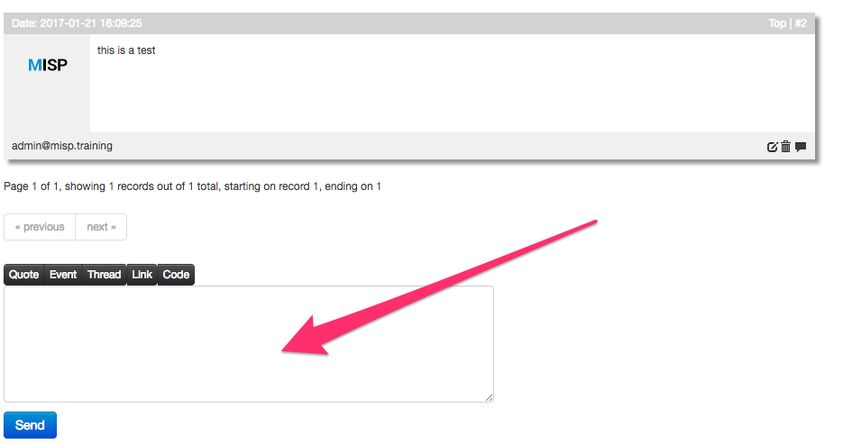
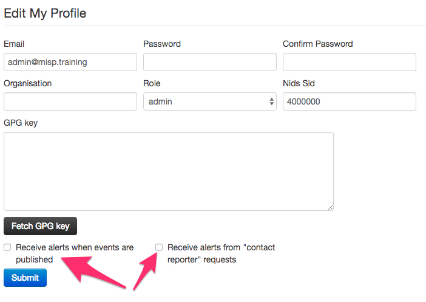

<!-- toc -->

## Sharing / Synchronisation

* [Explanation](#users)
* [Setup](#setup)
* [Roles](#roles)
* [Tools](#tools)
* [Server Settings](#server-settings)

* MISP's core functionality is sharing where everyone can be a consumer and/or a contributor/producer.
* Quick benefit without the obligation to contribute
* Low barrier access to get acquainted to the system

##Concept

##Setup

###Adding a server

Servers can be added by users via

~~~~
https://<misp url>/servers/add
~~~~

The Add Server Form has several input fields:

1. Base URL 

The base-url to the external server you want to sync with. Example: https://foo.sig.mil.be

2. Instance Name

A name that will make it clear to your users what this instance is. For example: Organisation A's instance

3. Remote Sync Organisation Type

The organization having the external server you want to sync with. Example: BE

4. Local Organisation

5. Authkey

You can find the authentication key on your profile on the external server.

6. Push

Allow the upload of events and their attributes.

7. Pull

Allow the download of events and their attributes from the server.

8. Self Signed

Click this, if you would like to allow a connection despite the other instance using a self-signed certificate (not recommended). (server certificate file still needed)

9. Server certificate file

You can also upload a certificate file if the instance you are trying to connect to has its own signing authority.  (*.pem)

10. Client certificate file

You can also upload a certificate file if the instance you are trying to connect to has its own signing authority.  (*.pem)

###Test connection

Test connection can be used to test the connection to the remote server and will give a feedback about local and remote version of MISP.

###Rules

Rules are used to limit sharing to e.g. events with a given tag, or disabling sharing for events containing a certain Tag.

####

##Collaboration

### Proposals

### Forums / Threats

Forums can be used to discuss non event related topics.

Discussions can be accessed on the top "Global Actions - List Discussions"

and via URL:

~~~~
https://<misp url>/threads/index
~~~~

####Create a new Topic

To create a new topic

~~~~
https://<misp url>/posts/add
~~~~

####Comment a topic

A topic can be commented by any user

~~~~
https://<misp url>/threads/view/<topic id>
~~~~

### Comments to events

In MISP ongoing events can be commented by every user.

### Contact a reporter

This feature can be used to contact the person or the organisation that the person belongs to that has created the event.

All E-Mails can be enforced to be encrypted

### Receive alerts

It is possible to get alerts via encrypted mail in the following cases:

* published events by other user of the MISP instance
* events pushed to the MISP instance
* events pulled by the MISP instance

These E-Mail alerts are an opt-in feature

