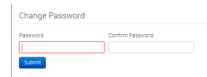

<!-- toc -->

## User Management and Global Actions

### First run of the system
When first logging into MISP with the username and password provided by your administrator, there are a number of things that need to be done, before you can start using the system.

*   **Accepting the Terms of use:** The terms of use are shown immediately after logging in for the first time, make sure to read through this page before clicking "Accept Terms" at the bottom of the page.
*   **Changing the password:** After accepting the ToU, you'll be prompted to change your password, but keep in mind that it has to be at least 6 characters long, it has to include at least one upper-case and one lower-case character in addition to a digit or a special character. Enter the same password into the confirm password field, before clicking submit to finalise the change.

*   **Setting up the GnuPG Key:** In order for the system to be able to encrypt the messages that you send through it, it needs to know your GnuPG key. Navigate to the Edit profile view (My Profile on the left -> Edit profile in the top right corner). Paste the key into the GnuPG Key field and click submit.
*   **Subscribing to Auto-alerts:** Turning auto-alerts on will allow the system to send you e-mail notifications about any new public events entered into the system by other users and private events added by members of your organisation. To turn this on, navigate to the Edit profile view (My profile on the left navigation menu -> Edit profile in the top right corner). Tick the auto-alert checkbox and click submit to enable this feature.

*   **Subscribing to e-mails sent via the "Contact Reporter" functionality:** This feature is turned on right below the autoalerts and will allow you to receive e-mails addressed to your organisation whenever a user tries to ask about an event that was posted by a user of your organisation. Keep in mind that you can still be addressed by such a request even when this setting is turned off, if someone tries to contact you as the event creator directly or your organisation for an event that you personally have created then you will be notified.
*   **Reviewing the Terms & Conditions:** To review the Terms & Conditions or to read the User Guide, use the appropriate button on the left navigation menu.
*   **Making sure that compatibility mode is turned off (IE9&IE10):** Compatibility mode can cause some elements to appear differently than intended or not appear at all. Make sure you have this option turned off.
